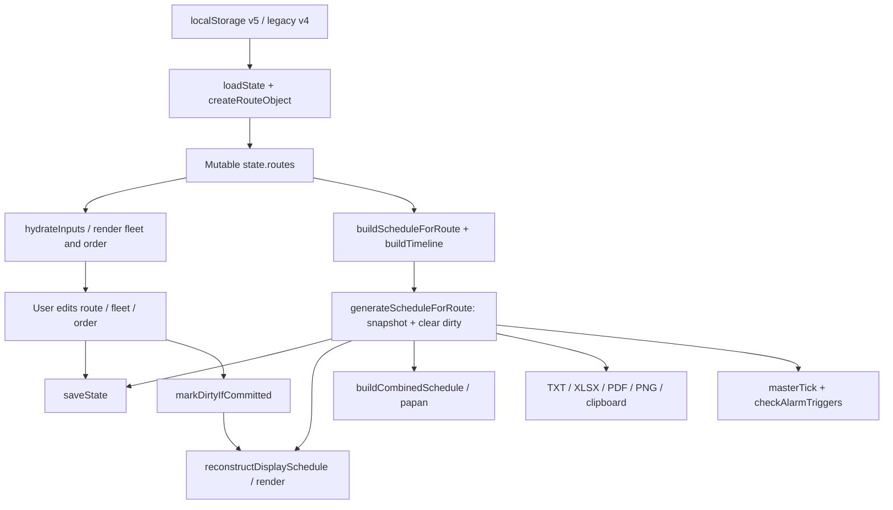
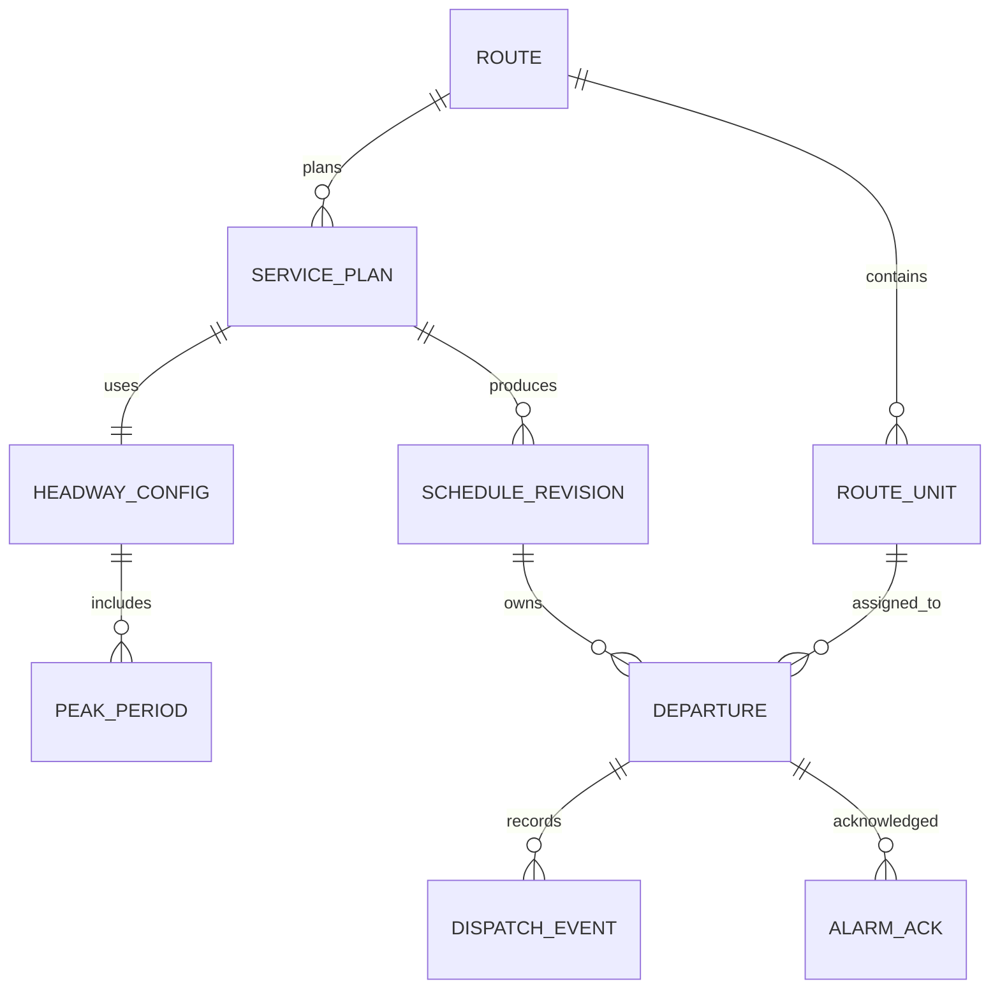
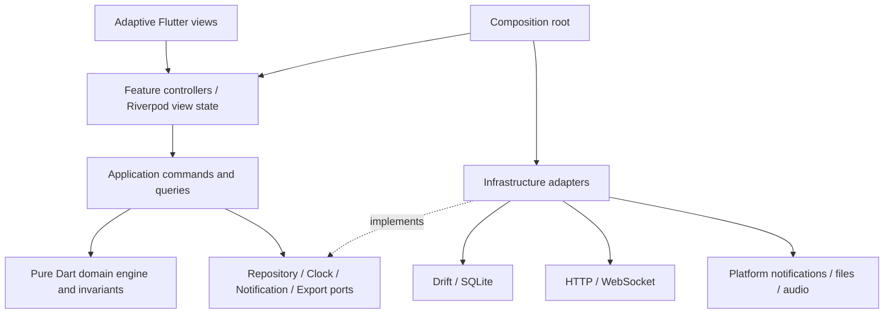
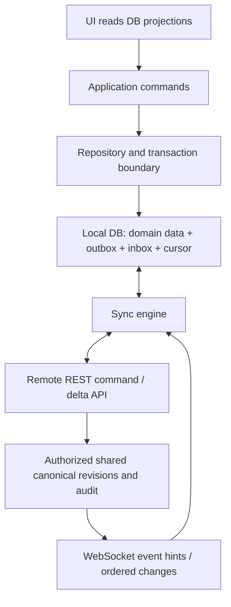
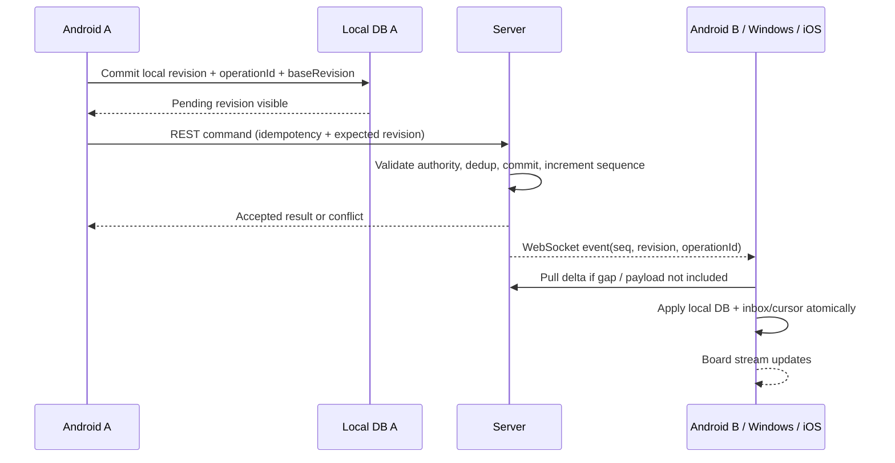
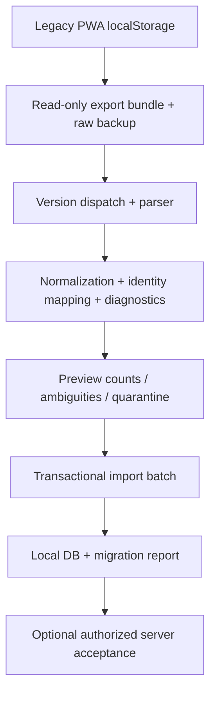

# HEDGE v2 — Architecture Assessment & Migration Blueprint

**HEDGE · Headway Generator · By Mikrotrans Utara**

Tanggal assessment: **5 Oktober 2026, Asia/Jakarta**

Baseline: branch **`devmode`**, commit **`d8edf44c45625bc93d2716e0e8e1c6c6265b3afe`**.

Dokumen ini merupakan specification dan proposal migrasi. Tidak ada implementasi Flutter, perubahan production source, deployment, atau perubahan business rule dalam assessment ini.

**Penanda evidence:** **[F]** = fakta source atau hasil eksekusi legacy; **[I]** = inference yang dijelaskan; **[R]** = rekomendasi untuk v2, belum merupakan behavior production. Nomor baris mengacu baseline di atas. Bukti rinci tersedia di [current-state-evidence.md](current-state-evidence.md), [scheduler-analysis.md](scheduler-analysis.md), dan [legacy-scheduler-reference.json](legacy-scheduler-reference.json). Keputusan yang belum dapat ditentukan dari source dicatat di bagian 19.

Urutan keputusan: correctness → reliability → offline capability → realtime consistency → operational UX → maintainability → performance → cross-platform consistency → development velocity.

## 1. Executive Summary

**[R] Pilihan utama: migrasi domain-first, dilanjutkan vertical slice Flutter; arsitektur feature-first dengan domain Dart murni, repository transaksional, Drift/SQLite lokal, Riverpod untuk presentation dan composition, serta REST + WebSocket untuk sinkronisasi.** Android menjadi platform pilot operasional; iOS dan Windows dibangun dan diuji sejak foundation, lalu UX desktop diperluas sesudah core dispatch stabil. Backend remote baru diperlukan ketika kolaborasi lintas perangkat diaktifkan, bukan untuk menghasilkan jadwal lokal.

**[F] HEDGE saat ini adalah aplikasi single-device dengan beberapa rute.** `app.js` mengelola state, scheduling, DOM, persistence, alarm, export, dan initialization dalam satu IIFE sepanjang 3.111 baris. `index.html` berisi markup, sekitar 1.700 baris CSS, serta script CDN. `server.js` adalah static Express server sepanjang 22 baris; tidak menyediakan API bisnis, authentication, database, atau WebSocket. Istilah realtime dalam aplikasi lama berarti jam/countdown lokal. Tidak ada sinkronisasi jadwal antar-dispatcher.

**[F] Business rule yang harus dipertahankan secara eksplisit:** satu rute memiliki armada dan urutan sendiri; generation/replan memakai unit yang saat itu aktif dan ada di urutan; target departure normal adalah `jumlah unit aktif dalam urutan × ritase`; urutan unit diulang per putaran; interval non-peak menggunakan dua bilangan menit yang berdekatan dengan blok cepat/lambat; ada dua konfigurasi peak; committed schedule tetap menjadi jadwal operasional saat parameter sedang diubah, termasuk rows unit yang kemudian dinonaktifkan/dihapus; hitung ulang berusaha mempertahankan prefix jadwal yang waktunya telah lewat; monitor gabungan menggabungkan committed rows rute yang ikut jadwal. Tidak ada optimasi konflik armada antar-rute atau constraint waktu perjalanan/pulang dalam source.

**[F] Risiko correctness lebih besar daripada masalah framework.** Peak scheduling membulatkan jumlah gap, menyusun durasi hasil kalkulasi, memotong/padding jumlah rows, lalu memaksa row terakhir ke jam selesai. Ini dapat menggeser batas peak, menghasilkan headway nol/negatif, dan menyembunyikan konfigurasi infeasible. Hitung ulang menghitung waktu yang telah lewat sebagai ritase selesai menggunakan nomor unit, bukan identity. Snapshot tidak memiliki tanggal layanan, timezone, revision, atau engine version. Alarm memakai HH:mm hari perangkat, dedup hanya di memory, dan tidak memiliki jaminan saat aplikasi ditutup.

**[R] Scheduling engine harus menjadi pusat specification.** Input immutable mencakup service date, service window, ordered unit IDs, target ritase, peak periods, dan policy version. Output berupa candidate revision + departures + diagnostics, tanpa DOM, database, jam sistem, network, atau audio. Replanning menerima frozen prefix dan cutoff secara eksplisit. Compatibility suite merekam output legacy; kasus bug tetap direkam tetapi tidak otomatis menjadi kontrak production v2. Perubahan peak, midnight, dan arti completed departure membutuhkan ADR dan keputusan bisnis sebelum engine yang diperbaiki dinyatakan siap.

**[R] Model operasional harus memisahkan tiga hal:** editable plan, committed schedule revision, dan actual dispatch events. Jadwal yang sudah lewat bukan bukti kendaraan sudah berangkat. Dirty state diturunkan dari input revision/hash terhadap committed input; alarm acknowledgement tidak membuat dispatch event secara otomatis. Revisi committed disimpan immutable dan pointer current revision diganti atomik. ID departure tidak boleh berupa index layar; semua board, alarm, export, dan sync merujuk identity yang sama.

**[R] Pilih hybrid offline-first.** Database lokal adalah sumber baca UI dan tempat write lokal yang durable. Server mengotorisasi dan mengurutkan state yang telah diterima bersama. Local write + outbox ditulis dalam transaksi yang sama; remote event + inbox/cursor juga atomik. Offline revision diberi status provisional/pending dan provenance perangkat. Saat dua dispatcher mengubah jadwal yang sama, gunakan expected revision dan conflict resolution yang terlihat, bukan silent last-write-wins. Tidak ada algoritma yang dapat menjamin satu keputusan global seketika ketika dua perangkat terputus; operasi perlu authority dispatcher per route/service day.

**[R] Rollout harus menjaga satu otoritas operasional.** PWA tetap berjalan sebagai produksi selama domain specification, fixture parity, Flutter local persistence, dan core UI dibangun. Pilot awal menjalankan Flutter dalam shadow/read-only untuk membandingkan jadwal. Sesudah sign-off, satu dispatcher/rute/hari ditetapkan memakai Flutter; PWA untuk scope tersebut menjadi referensi baca. Data transfer menggunakan export bundle yang diparsing dan divalidasi, karena native app tidak dapat membaca browser localStorage secara langsung. Rollback harus mencakup ekspor data/event yang dibuat setelah cutover, bukan hanya pemasangan versi aplikasi lama.

**[R] Stack dipilih berdasarkan sifat workload.** Data relasional, revisions, departures, dan outbox membutuhkan transaksi dan migration; karena itu Drift/SQLite lebih sesuai daripada satu JSON blob atau key-value store. Riverpod menyediakan scoped dependencies dan state/stream tanpa mengikat domain. Dio membantu timeout/interceptor/cancellation; retry tetap menjadi tanggung jawab sync engine dengan idempotency. Notification/audio/export berada di adapter platform. Dukungan package tidak dianggap sebagai jaminan alarm Android/iOS/Windows; kemampuan foreground, background, reboot, permission, dan sleep harus diuji secara terpisah.

Deliverable discovery ini cukup untuk memulai Phase 1 specification dan foundation: inventory fitur, domain invariants, algoritma legacy, test oracle yang dapat dieksekusi, target architecture, stack, sync protocol, capability matrix, migration parser design, budgets, security, roadmap dengan exit criteria, risk register, struktur repo, dan ADR candidates. Open questions dibatasi pada aturan operasional yang memang tidak disimpan oleh codebase.

## 2. Current State Assessment

### 2.1 Repository coverage dan entry points

| File/surface | [F] Isi dan peran | Implikasi migrasi |
| --- | --- | --- |
| `AGENTS.md` | Branch `devmode`, pnpm, branding, dual theme, target 44–48px | Semua pekerjaan tetap di `devmode`; proposal theme wajib dua mode |
| `index.html:1–2244` | Entry HTML; CSS inline; 4 tab, cockpit, drawer, boards, alarm overlay; CDN libraries | UI behavior diekstrak; layout lama bukan target Flutter |
| `app.js:1–3111` | IIFE; `loadState()` awal; listener bindings; master tick; render/auto-generation awal | Tidak ada module boundary atau exported domain API |
| `server.js:1–22` | Express static project root; wildcard mengirim index; bind `0.0.0.0`, `PORT || 3000` | Dev/static host, bukan backend domain |
| `sw.js:1–53` | `hedge-v12` app-shell, network-first GET, fallback cache/index | Offline shell berbeda dari durable data/sync |
| `manifest.json` | Install identity, standalone/fullscreen preference, icons | Identitas/icon dipakai native; SW tidak dipindahkan |
| `package.json` | Express saja; `dev/start`; `lint/build` exit 0 | Lint/build lama tidak membuktikan quality |
| `pnpm-lock.yaml`, `bun.lock` | pnpm mengunci Express 4.22.3; lock Bun juga ada | pnpm canonical sesuai aturan; jangan memakai Bun untuk migrasi |
| `README.md` | Fitur dan startup | Klaim offline/realtime harus dibaca bersama implementasi |
| `vercel.json` | Output directory project root | Hosting statis, tidak mengandung desain sync |
| `metadata.json` | Metadata capability Gemini server-side | Tidak ditemukan runtime Gemini/AI API di source; jangan invent fitur AI |
| `.env.example`, `.gitignore` | PORT dan ignore artifacts | Tidak ada kebutuhan environment backend bisnis saat ini |
| `assets/hedge-logo.jpg`, 5 icon PNG | Branding/install assets | Reuse berkas aset; audit ukuran/native launcher saat foundation |

Seluruh source aplikasi dibaca dalam audit root dan audit paralel. Generated dependency internals dan binary pixel contents bukan business source; manifest/rujukan aset tetap diperiksa. Tidak ada test suite, CI workflow, Dart source, schema DB, atau backend business API pada tracked baseline.

### 2.2 State, persistence, dan end-to-end flow

**[F] Persisted root:** `{activeRouteId, routes, papanMode}` pada `jadwalApp_multi_v5`. Setiap route menyimpan fleet, order, parameter, alarm preferences, export preferences, committed snapshot, dan boolean dirty (`app.js:4–200`). Runtime juga memiliki `lastSchedule`, selected unit IDs, filter/search, Sortable instance, papan mode/pointer, fired alarm keys, audio context, dan timer handles. Root `papanMode` yang dipersist tidak digunakan untuk initial runtime mode.



**[F] Startup:** load v5 → normalize routes/unit IDs → repair selected route → install listeners/timer → render controls/order (order renderer juga menulis state) → render committed schedule rute aktif jika ada; bila tidak ada, trigger tombol generate rute aktif (`app.js:3082–3111`). Rute kedua tidak otomatis dihitung hanya karena ada di default state.

**[F] Edit:** parameter/fleet/order berubah dan disimpan; jika snapshot memiliki rows maka `scheduleDirty=true`. Tampilan/countdown/alarm/export tetap memakai committed rows, tetapi sejumlah label memakai parameter live, sehingga label dapat berbeda dari isi jadwal. Alarm preference tidak membuat scheduler dirty. Tidak ada preview revision dan undo transaction.

**[F] Generate:** active order → filter active fleet → hitung rows → overwrite `committedSchedule` → clear dirty → save → reset alarm tracking → render. Generate-all iterasi per route dan menyimpan keberhasilan satu per satu; dapat menghasilkan batch partial success. Tidak ada transaksi semua rute.

**[F] Recalc:** waktu lokal kini → prefix rows dengan `jam <= nowMin` → completed counts by unit number → target R dan end dari snapshot lama → queue dari fleet/order/peak live → kalkulasi sisa mulai menit kini → concatenate → mutate snapshot → clear dirty (`1914–2015`). Tidak ada actual departure record maupun cutoff seconds.

### 2.3 Offline, dependency, dan reliability

**[F] SW offline shell:** install memakai `cache.addAll`, error ditelan, lalu `skipWaiting`; activate menghapus semua cache bernama lain dalam origin, lalu claim clients. GET mencoba network terlebih dahulu; status 200 basic/cors dapat dicache; saat fetch reject, fallback cached request lalu index. HTTP error bukan fetch rejection sehingga tidak otomatis memakai cache. Missing offline asset juga dapat mendapat HTML. CDN exports/fonts/Sortable/Swal tidak ada di app-shell; runtime cache tergantung pernah berhasil dimuat. Tidak ada atomic versioned release seluruh source dan vendor.

**[I] Dampak:** offline setelah warm load bisa berfungsi, tetapi first-install offline, cache eviction, CDN belum tercache, mixed-version source, dan gagal localStorage tetap perlu dianggap failure modes. Ini bukan bukti loss yang telah terjadi. `saveState` menelan quota/security failure sehingga UI tidak mengetahui durable write gagal (`194–200`).

**[F] Dependencies browser:** SheetJS 0.18.5, Sortable 1.15.2, html2canvas 1.4.1, jsPDF 2.5.1, SweetAlert2 11.10.5, Google Fonts (`index.html:22–29`). Tidak terlihat SRI, CSP, package-managed browser bundle, atau auth. Penilaian vulnerability package membutuhkan advisory scan tersendiri; assessment ini tidak mengklaim CVE tanpa verifikasi.

**[F] Tema:** hanya dark CSS variables; tidak ada light override/theme switch. Ini gap terhadap instruksi dual theme, bukan fitur yang sudah terverifikasi berjalan. Beberapa control lebih kecil daripada 44–48px; desktop memakai layout sempit, dan zoom dikunci oleh viewport. Tidak ada perubahan CSS dalam tahap ini.

### 2.4 Findings yang harus diregistrasikan sebelum rewrite

| ID | Severity operasional | [F] Temuan | Bukti | [R] Penanganan |
| --- | --- | --- | --- | --- |
| L01 | Tinggi | Peak allocation + endpoint coercion dapat menghasilkan gap negatif; oversubscription dapat gap akhir terlalu besar; no-peak padat dapat gap nol | `1539–1647` | Feasibility validator; oracle anomaly; ADR peak |
| L02 | Tinggi | Tidak ada service date/timezone; snapshot dipakai ulang lintas hari | `1728–1765`, `2629–2668` | ServiceDay identity, explicit rollover |
| L03 | Tinggi | Elapsed schedule dihitung selesai, bukan actual dispatch | `1930–1945`, `2613–2626` | Pisahkan frozen planned prefix, event, acknowledgement |
| L04 | Tinggi | Recalc memakai R/end snapshot lama tetapi parameter lain live dan clear dirty | `1920–2004` | Replan policy/input revision eksplisit |
| L05 | Tinggi | Persistence failure ditelan, invalid v5 dapat langsung fallback default | `117–200` | Durable transaction/error + quarantine; tidak overwrite source |
| L06 | Tinggi | Alarm exact-minute, memory-only dedup; close/sleep bisa melewatkan; reset bisa refire | `2406–2413`, `2629–2668` | Native adapter + ledger + catch-up/lifecycle policy |
| L07 | Sedang/tinggi | Route-local `_idx` dipakai board gabungan/global dismissed pointer | `2296–2315`, `2613–2649` | Departure ID, board projection lookup |
| L08 | Sedang | Duration/prep dibaca active route; prep sound mengabaikan enabled | `2274–2288`, `2592–2595` | Policy route milik departure, device preference |
| L09 | Tinggi untuk import | Constructor repair IDs tidak dedup order/route IDs/nomor; snapshot tidak remap identity | `11–84`, `117–190` | Deterministic parser, ambiguity report |
| L10 | Sedang | PNG mengabaikan shift/ritase labels export; XLSX metadata live; sheet collisions | `2774–2964` | Export dari immutable document model |
| L11 | Sedang | Dock recalc dapat full regenerate saat dirty banner tidak show | `3073–3076` | Aksi preview/replan/regenerate terpisah |
| L12 | Sedang | Dirty warning di drawer collapsed; branding kontras/light target belum lengkap | `index.html:1874–1990` | Visible status + dual theme acceptance |
| L13 | Sedang | New route selain nama JAK.88 diwarisi 39 unit sample JAK.115; clone loses custom order | `11–12`, `599–650`, `690–718`, `799–825` | Route kosong/template eksplisit; clone semantics |
| L14 | Tinggi untuk replan | `completedCount={}` memakai nomor unit sebagai property; `__proto__` menyebabkan remaining NaN dan future row hilang | `1928–1929`, fixture `remaining-prototype-unit-number` | Stable unit IDs + typed map, no label-keyed object |

Tidak ada finding di atas yang diperbaiki diam-diam dalam production code.

## 3. Feature Inventory

Criticality: **C0** correctness/durable dispatch; **C1** operasi harian; **C2** convenience. Disposition adalah rekomendasi scope, bukan perintah menghapus business rule.

| Fitur | Lokasi kode | Business criticality | Wajib dipertahankan | Perlu redesign | Kandidat dihapus | Catatan / disposition dan alasan |
| --- | --- | --- | --- | --- | --- | --- |
| Branding HEDGE/operator | HTML header `1779–1790`, exports | C1 | Ya | Styling native | Tidak | **MUST KEEP**: identitas operator konsisten |
| Multi-route configuration | `createRouteObject`, `599–850` | C0 | Ya | Ya | Tidak | **MUST KEEP**: fleet/config route mandiri; validasi uniqueness |
| Add/rename/clone route | `599–718`, `799–825` | C1 | Ya | Ya | Tidak | **REDESIGN**: explicit empty/template; clone order/alarm konsisten |
| Hide/reactivate route in schedule | `378–474`, `784–797` | C0 | Ya | Ya | Tidak | **REDESIGN**: saat ini juga menonaktifkan alarm; bedakan board filter dengan participation |
| Permanent route deletion | `827–846` | C0 | Ya, archive equivalent | Ya | Hard delete history | **REDESIGN**: archive/tombstone agar audit dan sync tidak kehilangan references |
| Add/delete fleet unit | `1243–1277`, `1401–1419` | C0 | Ya | Ya | Hard delete references | **REDESIGN**: stable ID, per-route number uniqueness, archive history |
| Active/inactive unit | `1207–1229` | C0 | Ya | Scope service day | Tidak | **MUST KEEP**: inactive dikeluarkan dari candidate, committed tidak otomatis berubah |
| Bulk unit activation/deletion | `1279–1360` | C1 | Ya | Ya | Tidak | **REDESIGN**: one transaction, undo saat belum publish, impact preview |
| Unit search/filter/select all | `1065–1183`, `1362–1375` | C1 | Ya | Ringan | Tidak | **MUST KEEP**: mempercepat armada besar, scope selection jelas |
| Custom departure order | `1438–1528` | C0 | Ya | Ya | Tidak | **MUST KEEP**: permutation IDs, reorder accessible |
| Sortable multi-drag | `1420–1527` | C2 | Outcome reorder | Ya | Plugin/gesture 1:1 | **DEFER**: step/move-to-position wajib awal; multi-drag sesudah UX field test |
| Operational start/end time | `892–900`, `1672–1691` | C0 | Ya | Ya | Tidak | **MUST KEEP**: service-day aware; overnight keputusan terpisah |
| Ritase target 1–30 | `902–930`, `1680–1693` | C0 | Ya | Ya | Tidak | **MUST KEEP**: target per active unit, bukan actual trip duration |
| Fast-first/slow-first headway blocks | `958–976`, `1544–1559` | C0 | Ya | Presentation | Tidak | **MUST KEEP**: jangan mengganti dengan alternating atau round-each-departure |
| Two peak periods/fixed interval | `933–955`, `1562–1647` | C0 | Ya, business intent | Ya | Unsafe coercion | **REDESIGN**: validate feasibility/overlap/boundaries; preserve fixtures |
| Generate active route | `1728–1748`, `1851–1874` | C0 | Ya | Preview+commit | Tidak | **REDESIGN**: jangan destructive replacement tanpa revision |
| Generate all participating routes | `1879–1910` | C1 | Ya | Batch result | Tidak | **REDESIGN**: per-route result jelas; all-or-nothing opsional jika shared constraints muncul |
| Committed schedule separate from edits | `250–267`, `1728–1765` | C0 | Ya | Immutable version | Tidak | **MUST KEEP**: operasi tidak berubah diam-diam saat config diedit |
| Dirty state/banner | `250–267`, HTML `1986` | C0 | Ya | Ya | Mutable boolean as authority | **REDESIGN**: derive input hash, warning selalu terlihat |
| Recalculate remaining/history prefix | `1914–2015` | C0 | Ya, intent | Ya | Assumption elapsed=actual | **REDESIGN**: frozen prefix dan replan policy, identity-based counts |
| Schedule table/ritase/peak/headway markers | `1767–1847` | C1 | Ya | Virtualized list | Tidak | **MUST KEEP**: committed status/revision di semua read models |
| Mobile cockpit/live countdown | `2970–3055` | C1 | Ya | Ya | Index/time-based actual labels | **REDESIGN**: satu next-departure projection, visible stale/provisional |
| Active-route board | `2149–2217`, `2374–2394` | C1 | Ya | Native layout | Tidak | **MUST KEEP**: glanceable monitor |
| Combined route board | `2082–2118`, `2157–2217` | C1 | Ya | ID/ordering | Tidak | **MUST KEEP**: aggregate monitoring; route headway tetap per route |
| Fullscreen/wake lock/auto-center | `2219–2232`, `2338–2394` | C1 | Ya, capability | Ya | Browser API direct use | **REDESIGN**: lifecycle-aware board; auto-center pause saat user scroll |
| Departure sound/overlay/acknowledgement | `2400–2668` | C0 | Ya | Ya | Fake actual dispatch | **REDESIGN**: alarm ledger/native fallback; acknowledge berbeda dari departed |
| Preparation warning/beep/vibration | `2234–2293` | C1 | Ya | Ya | Active-route leak | **REDESIGN**: target route policy dan foreground/background contract |
| Indonesian TTS/unit pronunciation | `2454–2573` | C2 | Basic alert | Ya | Tidak | **DEFER**: local voice availability diuji; audio/visual fallback wajib |
| TXT/clipboard WhatsApp-ready | `2020–2067`, `2797–2817` | C1 | Ya | Share+clipboard | Tidak | **MUST KEEP**: offline communication; source tidak mengirim pesan |
| Single-route XLSX | `2819–2848` | C1 | Ya | Valid document | Tidak | **MUST KEEP**: operational reports, safe strings/sheet names |
| All-route multi-sheet XLSX | `2851–2919` | C1 | Ya | Ya | Tidak | **MUST KEEP**: dedup sheet names, master provenance |
| PDF | `2921–2955` | C1 | Ya | Pagination | Tidak | **MUST KEEP**: printable offline schedule |
| PNG export | `2957–2964` | C2 | Sesudah core exports | Ya | DOM screenshot strategy | **DEFER**: pure document renderer dengan pagination/size cap |
| Export shift/ritase display offset | `2720–2795` | C1 | Ya | Ya | As domain shift | **MUST KEEP**: offset hanya label, tidak mengubah target/trip identity |
| Local persistence/reload restoration | `117–200`, `3094–3111` | C0 | Ya | Ya | Silent fallback/write errors | **REDESIGN**: relational DB, transactions, verified migration |
| v4→v5 legacy storage migration | `136–190` | C0 | Ya, import equivalent | Ya | Random repair/overwrite | **REDESIGN**: deterministic bundle import, quarantine/report |
| PWA installation/offline shell | manifest, SW, HTML `2236–2241` | C1 selama coexist | PWA existing | Native replacement | SW dalam native | **REMOVE** dari native target: distribusi native dan bundled assets menggantikan shell; PWA tetap sampai cutover |
| Hard-coded seed fleet pada route baru | `7–12` | C2 | Tidak | Explicit template | Ya | **REMOVE** implicit seeding; sample/template hanya opt-in |
| Long-press tooltips/animations | `271–320`, CSS | C2 | Accessible help | Ya | Interaction 1:1 | **REDESIGN**: labeled controls, reduced motion, semantics |
| Static Express/Vercel wrapper | server/vercel/package | C2 native | Selama legacy | New API later | Dalam native app | **REMOVE** dari native runtime; tidak dijadikan sync backend tanpa desain baru |
| Metadata Gemini capability | `metadata.json` | Tidak terbukti | Tidak | Tidak | Ya | **REMOVE** dari target requirement sampai ada use case nyata |
| Dark + light theme | dark only CSS `32–67` | C1 | Ya sebagai v2 requirement | Ya | Tidak | **REDESIGN**: light belum ada; ThemeData/ColorScheme dua mode |

## 4. Domain Model

### 4.1 Model aktual vs model yang dibutuhkan

**[F] Aggregate praktis legacy adalah Route blob.** Unit berada di dalam route; departure rows membawa nomor unit, bukan unit ID. Shift hanya export label. Schedule adalah snapshot yang dapat dimutasi. Dispatch Event, service date, actual status, operator, dan revision belum ada.

**[R] Domain boundaries:** route/fleet configuration; service-day planning dan schedule revisions; dispatch event/acknowledgement. Sync/outbox/device settings merupakan application/infrastructure data, bukan inti algoritma headway. Jangan menambahkan driver rostering, vehicle GPS, travel-time optimization, atau depot entity tanpa kebutuhan operasional.



| Object dan jenis | Tujuan/fields minimum [R] | Relationship dan invariant | Lifecycle/pemilik perubahan | Truth atau derived |
| --- | --- | --- | --- | --- |
| `Route` entity | `routeId`, `code/name`, `displayColor`, `archived`, `configVersion` | ID stabil; code normalized unique dalam scope operasi; color bukan business input | Create→active→archive; editor berotorisasi | Persisted configuration truth |
| `RouteUnit` entity | `routeUnitId`, `routeId`, `unitNumber` string, `archived` | Identity tidak sama dengan nomor; nomor unique per route; leading zeros dipertahankan | Add→available→archive; editor; history tetap refer ke ID | Persisted truth; tidak mengklaim global vehicle identity |
| `ServiceDay` value object | `localDate`, `zoneId`, `startOffset`, `endOffset`, `endDayOffset` | Window increasing pada service timeline; konversi UTC dilakukan eksplisit | Immutable; dispatcher memilih hari; default proposed Asia/Jakarta | Authoritative time context |
| `ServicePlan` aggregate | `planId`, `routeId`, `serviceDay`, `activeUnitIds`, `orderedUnitIds`, `headwayConfig`, `inputVersion`, `currentRevisionId`, participation | Order adalah permutation unit aktif; referensi route units valid; satu current revision per plan | Draft→candidate→committed; revisi berikutnya mengganti pointer; dispatcher route/day | Editable planning truth dan committed pointer |
| `HeadwayConfiguration` value object | target ritase integer, fast/slow block policy, min headway, peak enabled/periods, engine policy version | R>0; UI legacy R≤30 bukan otomatis domain limit universal; no invalid interval; explicit feasibility | Immutable bersama input version; editor | Input truth |
| `PeakPeriod` value object | start/end offsets, target interval, priority/policy | clipped window valid; overlap resolution eksplisit; half-open boundary untuk v2 proposed | Immutable; bagian headway config | Input truth, normalized periods derived |
| `ScheduleRevision` entity/aggregate output | ID, plan ID, parent revision, input snapshot/hash, engine version, createdBy/device/at, reason, cutoff, content hash, acceptance state | Rows immutable setelah commit; lineage; imported rows tidak regenerate otomatis; accepted global base version eksplisit | Candidate→locally committed pending→server accepted/conflicted→superseded | Committed output adalah operational truth untuk revision itu |
| `Departure` entity | stable ID, revision ID, routeUnitId, unit label snapshot, ordinal, ritase, service offset/planned UTC, next gap, peak tag | Planned times ordered; nonnegative dan minimum gap sesuai policy; last next-gap null; ID bukan table index | Generated→committed; perubahan via new revision; canceled/superseded mapping eksplisit | Time/assignment committed truth; next gap/tag derived dari frozen rows/config |
| `DispatchEvent` append-only entity | event/command ID, departure ID, action, actual occurredAt, actor/device, observed revision, server seq/time, correctionOf/reason | Server validates scope/transition; no edit/delete history; duplicate command idempotent | Pending→accepted/conflict; corrections append new event; dispatcher | Actual operational facts dengan provenance, bukan elapsed inference |
| `AlarmAcknowledgement` record | departure/revision/device, acknowledgedAt, mode manual/auto, notification instance | Menutup bunyi ≠ unit berangkat; scope device by default | Device user/auto-stop; durable jika perlu dedup | Device acknowledgement truth, bukan dispatch fact |
| `AlarmPolicy` value object | enabled, preparation seconds, duration, sound selection; route defaults + device mute | 0–60 prep / 1–30 duration kompatibilitas UI awal; target route policy | Setting changes; tidak mengubah schedule input hash | Setting truth |
| `ExportRequest` value object | revision IDs, format, display shift, display ritase offset, locale | Semua isi dari same frozen revision; offset tidak mengubah ritase domain | One-shot user request; preference terpisah | Request truth; rendered document derived |
| `DispatchBoardProjection` read model | next departure IDs, elapsed/due/actual states, route totals, stale/pending | Status planned/actual/pending jelas; stable deterministic sort | Derived on DB stream + injected clock; tidak menulis state | Derived |
| `SyncOperation/InboxCursor` infrastructure records | command ID, base version, payload, attempts, queue status; consumed event IDs/cursor | Atomic dengan data mutation; retry preserving command identity | Sync coordinator | Delivery metadata truth, bukan scheduler input |

**[R] Scope identity awal:** gunakan `RouteUnit` karena source tidak membuktikan kendaraan fisik yang sama dipakai lintas route. Jika cross-route shared vehicle memang ada, tambahkan `Vehicle` global dan route assignment setelah keputusan bisnis; jangan menyimpulkan seluruh nomor sama adalah kendaraan sama.

**[R] Departure identity lintas revision:** `departureId` mengidentifikasi logical occurrence; immutable row snapshot/association menggunakan pasangan `(revisionId, departureId)`. Prefix yang dipertahankan membawa ID, unit, ritase, planned time, dan actual facts yang sama; row revision lama tetap tersimpan. `nextGap` adalah derived projection untuk revision baru, sehingga last-prefix gap direcompute terhadap suffix baru tanpa mengubah fakta keberangkatan lama. Contoh: C1 05:08 tetap C1 05:08, tetapi gap menuju suffix baru 05:10 menjadi2min, bukan stale4min legacy. Future occurrence yang dibatalkan memiliki supersession/cancellation mapping; replacement baru mendapat identity baru kecuali policy secara eksplisit mempertahankan logical occurrence yang dipindah. Actual event menyimpan departure ID serta observed revision, sehingga replan tidak memindahkan fakta actual ke unit/ritase lain. Detail relasi snapshot/identity dikunci ADR06 sebelum schema implementation; diagram `owns` di atas menunjukkan snapshot membership, bukan alasan mengganti semua IDs setiap render.

**[R] Dirty:** `canonicalSchedulingInputHash(draft) != committed.inputHash`. Alarm preferences, selected tab, export shift/label offset, dan board filter tidak masuk hash. Color/name label policy dibedakan: historic exports memakai snapshot label, board boleh current display name dengan identity tetap. Perubahan membership/order/R/window/peak masuk hash. Dirty tetap benar setelah restart; UI menampilkan draft input version dan committed revision yang sedang dipakai.

**[R] Participation:** pisahkan `boardFilter` perangkat dari `includedInService` route/day. Legacy `activeInSchedule` diimport sebagai participation awal karena mempengaruhi generation, alarm, combined, dan export. Filter visual baru tidak boleh menghentikan alarm secara diam-diam. Empty workspace v2 boleh ada; aturan legacy minimum satu route merupakan UI guard, bukan hukum scheduling.

## 5. Scheduler Analysis

### 5.1 Input dan behavior legacy yang benar-benar ditemukan

**[F] Functions:** `toMinutes`/`toHHMM` (`1530–1536`), `buildTimeline` (`1539–1647`), `isPeakAtOffset` (`1650–1653`), `buildScheduleForRoute` (`1672–1726`), commit (`1728–1748`), recalc (`1914–2015`), combine (`2082–2118`).

1. **Fleet/order:** map `departureOrder` ke `masterUnits.find(id)`; ambil number bila active; `filter(Boolean)`. Duplicate order IDs tidak dibuang oleh builder. N adalah panjang hasil ini, bukan selalu jumlah unique active units.
2. **Ritase:** `parseInt(route.ritase) || 1`; UI membatasi 1–30, tetapi builder tidak menegakkan semua batas atau type valid. Input dari storage bisa bypass UI.
3. **Window:** HH:mm dikonversi minute of day; end harus strictly setelah start. Overnight seperti 23:00→01:00 ditolak. Date/timezone tidak ada.
4. **Total:** D=N×R departures dan G=D−1 gaps. D=1 menghasilkan satu departure di start, tanpa segment; tidak ditaruh di end.
5. **Non-peak:** T=end−start; low=floor(T/G), high=low+1; y=T−low×G gaps high dan x=G−y gaps low. Fast-first menaruh seluruh low sebelum high; slow-first sebaliknya. Bukan distribusi alternating/evenly interleaved.
6. **Peak:** dua windows raw; clamp ke operational window; invalid/reversed/empty window diabaikan; sort start; overlap **dan touching** (`p.s<=last.e`) digabung menjadi union dengan interval minimum untuk seluruh union.
7. **Peak gap budget:** tiap peak `max(1, round(duration/interval))`. Jumlahnya dikurangi dari G. Offpeak menerima sisa G secara proportional duration memakai floor + largest remainder; tie mengikuti stable input order. Jika tidak ada offpeak dan masih sisa, tambah ke peak terakhir.
8. **Intervals:** peak memakai fixed interval sebanyak gap yang dihitung; offpeak floor/ceil blocks sesuai order. Timeline result disusun kumulatif dari nol, bukan ditempel kembali pada absolute peak start/end input.
9. **Endpoint coercion:** offsets yang kurang dipadding T; offsets yang lebih dipotong ke D; offset terakhir selalu T. Render segments tidak direkonsiliasi dengan hasil truncation/coercion. `error` timeline selalu null untuk jalur normal.
10. **Rows:** unit cycle `units[i%N]`; ritase `floor(i/N)+1`; next headway `offset[i+1]-offset[i]`; last null. `isPeak` mengecek inclusive kedua batas dan mengembalikan segment pertama yang match.
11. **Multi-route:** tiap route dihitung independen. Combined hanya sort frozen rows by HH:mm lalu route name localeCompare dan memberi combinedNo; interval masih gap route asal. Simultaneous departure antar-route diizinkan source, tanpa collision handling.

### 5.2 Pseudo-code legacy

```text
LEGACY_GENERATE(route):
  units = ordered IDs resolved to active unit numbers
  N = length(units)
  R = parseInt(route.ritase) or 1
  start = parseHHMM(route.start)
  end = parseHHMM(route.end)
  if N == 0: return localized error
  if end <= start: return localized error
  D = N * R
  G = D - 1
  T = end - start
  if G <= 0: offsets = [0]; segments = []
  else if peak disabled:
    gaps = floor/ceil blocks whose integer sum is T
    offsets = cumulative([0], gaps)
    segments = [nonpeak segment]
  else:
    peaks = clamp, remove empty, sort, merge touching/overlap using minimum interval
    timeline = alternating absolute offpeak and peak durations
    peakGapCount = sum(max(1, round(peak.duration / peak.interval)))
    remaining = G - peakGapCount
    distribute positive remaining over offpeak durations by largest remainder
    if no eligible offpeak and remaining > 0: add remaining to last peak
    for segment:
      peak gaps = repeat requested interval
      offpeak gaps = floor/ceil duration blocks for allocated gap count
    offsets = cumulative gaps without resetting cursor to absolute boundaries
    append T until count D; truncate to D; force last offset T
    segments = accumulated pre-truncation ranges
  for i in 0 through D-1:
    emit ordinal=i+1, unit=units[i mod N], ritase=floor(i/N)+1
    time=start+offsets[i], nextGap=offsets[i+1]-offsets[i] or null
    peak=first inclusive matching output segment
```

**[F] Example non-peak:** 2 units `[A,B]`, R=2, 05:00–05:10 → D=4, G=3, low=3, x=2, y=1. Fast-first rows `A/1/05:00/+3`, `B/1/05:03/+3`, `A/2/05:06/+4`, `B/2/05:10/null`. Slow-first times 05:00,05:04,05:07,05:10. Reference artifacts berisi output aktual source, bukan hanya contoh hitungan manual.

### 5.3 Recalc adalah algoritma kedua

```text
LEGACY_RECALC(committed, currentRoute, nowMinute):
  reject unless committed.start < nowMinute < committed.end
  history = committed rows with time <= nowMinute
  done[number] = count(history rows by number)
  target = committed.R
  remaining active units = current order with max(0, target-done[number]) > 0
  queue = round-robin remaining units with ritase = done[number]+1
  if queue empty: retain only history and clear dirty
  otherwise buildTimeline(nowMinute, committed.end, length(queue), current peaks/order)
  future first departure is at nowMinute, including if history also ends at nowMinute
  concatenate history + future, set boundary/history count, update N, clear dirty
```

**[F] Tidak ada actual departure input.** Recalc mempertahankan past rows unit yang kini inactive/deleted, memberi unit baru target snapshot R penuh, dan menggabungkan dua identities bila number sama. Changed end/R di draft tidak digunakan. History last gap dan segmentsInfo snapshot tidak diperbaiki mengikuti future baru. Alarm tracking seluruh route direset setelah recalc rute aktif.

### 5.4 Edge cases, assumptions, dan ambiguity

| Kasus | [F] Legacy | [R] V2 contract |
| --- | --- | --- |
| N=0 | Error localized | Typed `noActiveUnits`, no commit |
| D=1 | Departure di start; no peak segment | Preserve start anchor, tidak menuntut end anchor sekaligus |
| G>T minute | Gap 0 mungkin | Explicit minimum positive headway atau approved simultaneous policy; infeasible error |
| Negative/malformed R/time | Coercion, NaN/exception kemungkinan | Validate numeric range dan HH:mm/service offsets sebelum allocation |
| Overnight | End<=start error | Day offset eksplisit bila disetujui; formatter tidak membuang tanggal |
| Peak di luar window/reversed | Clamp/drop | Report normalized input dan warning/error, tidak silently drop |
| Peak touching/overlap | Union + minimum interval pada seluruh union | Policy version; jangan mengubah tanpa ADR karena timetable berubah |
| Duration tidak habis dibagi peak interval | Round; accumulated boundary drift | Explicit transition/remainder policy atau infeasible; tidak force last row |
| Peak gaps melebihi G | Truncate lalu force end, negative gap bisa terjadi | Feasibility error dengan jumlah gap yang dibutuhkan/tersedia |
| Full window peak, D berbeda | Extra gaps ditambahkan last peak lalu forced end | Validate endpoint/count constraints, jelaskan constraint yang konflik |
| Peak boundary | Inclusive first segment wins | Proposed half-open `[start,end)`; approved output deltas required |
| Duplicate order/number | Duplicates ikut schedule; recalc merges number | Unique ID permutation, ambiguity quarantine |
| Multi-route same time | Allowed; names sort | Stable sort UTC/route ID/ordinal; simultaneous policy tetap per use case |
| Elapsed at cutoff | `<=` frozen/completed; future at same minute | Frozen prefix invariant dan explicit next allowed instant; actual fact terpisah |
| Generate/reset at due minute | Fired set reset, can refire | Durable dedup keyed departure/revision/day/device and alert kind |

### 5.5 Desain engine Dart murni yang direkomendasikan

**[R] Bukan port DOM function.** Domain package mengekspos operasi `validatePlan`, `generateCandidate`, `replanCandidate`, dan `projectDueDepartures`, masing-masing menerima data immutable dan menghasilkan result typed. ID generation, clock, conversion timezone, persistence, authorization, localization, serta notification berada di caller/adapter. Input yang sama, policy version sama, dan ID seed sama menghasilkan rows dan diagnostics sama. Gunakan integer service offsets; represent minute granularity legacy dan seconds untuk alarm/cutoff secara berbeda.

**[R] Tahapan engine:**

1. Validate identity/order/target/window; buat canonical input hash tanpa color/presentation. Resolve unit IDs dengan map O(N), bukan repeated `.find`.
2. Normalize peak windows ke timeline service day. Untuk compatibility, pertahankan overlap merge dan rounding tepat seperti fixtures. Untuk corrected policy, rules overlap/boundary dan remainder harus terdefinisi dalam ADR.
3. Tentukan target departure budget dan feasible positive gap budget. Kalkulasi count/duration per segment beserta diagnostics; setiap positive-duration segment perlu coverage yang benar. Jangan menerima segment terlewati karena gap budget nol.
4. Allocate integer non-peak gaps memakai floor/ceil blocks dan deterministic largest-remainder tie break. Peak target intervals tetap business intent; bila residual boundary tidak cocok, pilih approved transition rule atau return `infeasiblePeakPlan`, bukan padding/truncation.
5. Compose chronological offsets tanpa koreksi endpoint paksa. Validate count, anchors, minimum gap, coverage, dan peak rules pada seluruh hasil. D=1 ditangani explicit.
6. Assign ID-based unit cycle/ritase; derive nextGap dari final immutable offsets; derive peak tag dari approved absolute windows. Simpan allocation diagnostics untuk review operator.
7. Return candidate. Application layer melakukan preview/diff, revision commit transaksional, dan alarm reschedule setelah commit berhasil.

```text
GENERATE_CANDIDATE(input, policy, deterministicIdSeed):
  validated = validateInput(input)
  if invalid: return typed failures
  normalized = normalizePeriods(validated, policy)
  allocation = allocateGapBudget(normalized, validated.departureCount, policy)
  if infeasible: return diagnostics and conflicting constraints
  timeline = composeOffsets(allocation)
  if resultInvariantsFail(timeline): return typed infeasible result
  departures = assignUnitsAndRitase(timeline, validated.orderedUnitIds, deterministicIdSeed)
  return immutable candidate(inputHash, policy.version, departures, diagnostics)

REPLAN_CANDIDATE(previousRevision, frozenPrefix, newInput, explicitCutoff, policy):
  validate lineage, frozen identity, cutoff and window
  remaining = target policy minus approved per-unit completed/frozen counts
  queue = deterministic remaining round-robin using new ordered IDs
  candidateSuffix = generate timeline for queue and approved next-allowed instant
  validate frozen prefix authoritative fields unchanged and suffix follows boundary
  derive nextGap for new revision, including gap crossing prefix/suffix splice
  return new revision with lineage and departure mapping; never mutate previous revision
```

**[R] Two contracts:** `legacy-v1` dipakai sebagai characterization/reference; `validated-v2` untuk proposed corrections. Parity pada normal inputs wajib. Unsafe legacy fixtures tetap lulus characterization tetapi corrected engine harus memberi typed rejection/approved difference. Jangan menyebut migration PASS hanya karena buggy peak output sama. Tidak perlu general optimization solver/ML; segmented integer allocation + validation cukup sampai ada travel-time/shared-vehicle constraint nyata.

## 6. Target Architecture

### 6.1 Alternatif dan pilihan

| Pendekatan | Kesesuaian | Trade-off | Keputusan [R] |
| --- | --- | --- | --- |
| Strict Clean Architecture untuk semua CRUD | Dependency direction/testable | Use-case/entity/mapper berulang untuk operasi sederhana | Ambil dependency rules; hindari boilerplate universal |
| Feature-first saja | Bounded agent tasks, feature mudah ditemukan | Scheduler bisa terduplikasi/terikat provider jika boundary lemah | Pilih sebagai physical organization |
| Domain-driven modularity | Tepat untuk schedule revisions/dispatch invariants | Full DDD, event sourcing, microservices terlalu berat | Bounded domain modules; terminology/invariants, tanpa framework DDD |
| MVVM presentation + repositories | Sederhana untuk Flutter streams/form state | Complex rules dapat bocor ke view models | Controllers/view models hanya orchestration/presentation |
| Repository pattern | Local source/sync/testing dapat diganti | Generic repository menghilangkan domain transaction semantics | Typed aggregate repositories, no generic CRUD facade |
| Global service locator | Setup cepat | Hidden dependencies/test isolation sulit | Constructor injection + provider composition root |
| Backend-specific client as UI truth | Rapid cloud demo | Offline/error/conflict coupling ke widget | Remote adapter hanya di infrastructure |

**[R] Pilih feature-first modular architecture dengan dependency inversion pada domain/application boundaries.** Pure `hedge_domain` package hanya untuk scheduling/dispatch rules yang harus bebas Flutter. Feature route/fleet/schedule/dispatch/board/export menggunakan model tersebut. Satu app dan satu backend modular monolith cukup; pemisahan package tambahan menunggu reuse nyata. Prinsip pemisahan UI, repository, service, dan domain kompleks sejalan dengan [Flutter architecture guide](https://docs.flutter.dev/app-architecture/guide); detail authority/revisions adalah desain spesifik HEDGE.



### 6.2 Function placement dan separation plan

| Layer | Legacy functions/fragments | Target tanggung jawab [R] |
| --- | --- | --- |
| Presentation | `render`, `renderUnitList`, `renderOrderList` DOM fragment, `renderRouteBar`, `renderPapanBoard`, `hydrateInputs`, tooltips, drawer/dock, `showToast/showError` | Widgets, responsive layouts, semantics, form state, read model formatting; tidak menyimpan/repair business state |
| Application | `generateScheduleForRoute`, generate-all handlers, `recalcRemaining` orchestration, add/bulk/delete/reorder handlers, export form orchestration, `resetAlarmTracking` lifecycle | Validate command authority, invoke pure domain, transaction, publish local result, reconcile alarm plans; batch result eksplisit |
| Domain | `buildTimeline`, `buildScheduleForRoute` computation, `isPeakAtOffset`, fleet/order normalization rules, remaining queue/count calculation, due/next-departure selection | Input validation, allocation, immutable revisions, ID/status invariants; tanpa widgets/provider/plugin |
| Infrastructure | `loadState/saveState`, v4 parser I/O, `beep/AudioContext`, speech, vibrate, wake lock/fullscreen, download/clipboard, XLSX/PDF/PNG libraries, `server.js`, `sw.js` | DB/DTO adapters, sync transport, legacy parser, device channels, rendering bytes/file output |
| Split across layers | `renderOrderList` repairs order+save; `recalcRemaining` reads Date+calculates+mutates+renders; `updatePapanHighlight` selects due+mutates DOM; `doExportSingle` saves preferences+maps+downloads | Move mutations/calculation to commands/domain; renderer becomes read-only consumer |

**[R] Commands awal:** `CreateRoute`, `SetRouteParticipation`, `SetUnitActive`, `ReorderUnits`, `UpdatePlanInput`, `GenerateScheduleCandidate`, `CommitScheduleRevision`, `ReplanRemaining`, `RecordDeparture`, `AcknowledgeAlarm`, `ExportRevision`, `ImportLegacyBundle`. Simple reads dapat watch repository streams; tidak harus kelas use case baru untuk setiap property getter.

**[R] Repository boundaries:** route/fleet configuration; service plans/revisions/departures; dispatch events; migration/import transactions. Satu `LocalUnitOfWork`/transaction boundary dapat melakukan write lintas tabel plus outbox atomik. Repository implementation tidak memanggil repository lain; application menggabungkan ports. Remote sync memakai ingestion transaction yang sama, tidak langsung mengubah provider state.

**[R] Dependency rules:** domain tidak import Flutter/Riverpod/Drift/Dio; application import domain + port interfaces; infrastructure implements ports; presentation menggunakan application/public query APIs; composition root mengetahui concrete adapters. Error types dipisahkan validation, persistence, auth, conflict, transport, platform permission. UI menampilkan kategori yang operasional, bukan stack traces.

## 7. Recommended Flutter Stack

**[R] Versi dikunci setelah compatibility spike, bukan mengambil semua package latest sekaligus.** Dokumentasi yang diperiksa pada tanggal assessment menampilkan Flutter stable 3.47.0 dan support matrix Flutter 3.47: Android API 24–37, iOS 15–27, Windows 10/11 x64/arm64. Itu snapshot dokumentasi, bukan hasil build HEDGE. Pin satu tested stable SDK, Dart bawaan SDK, dependency lockfile, dan minimum platform yang memenuhi requirement SDK serta setiap plugin. Jangan menjanjikan dukungan perangkat Android lama sebelum inventaris perangkat lapangan. [Release notes](https://docs.flutter.dev/release/release-notes), [supported platforms](https://docs.flutter.dev/reference/supported-platforms).

| Area | Pilihan [R] | Alternatif dan reasoning | Gate verifikasi |
| --- | --- | --- | --- |
| UI | Flutter stable + Material 3 `ThemeData/ColorScheme`, app-owned HEDGE tokens | Cupertino behavior pada navigation/dialog bila platform memerlukannya; jangan membuat tiga engine/layout business berbeda | Android/iOS/Windows build; accessibility, IME, focus dan theme tests |
| Adaptive | `LayoutBuilder`, window size, NavigationBar/Rail, separate compact/workstation views | Device-name branching terlalu kaku untuk resize/foldables | 360px mobile, landscape, desktop narrow/large windows; text scale |
| State | `flutter_riverpod`, `Notifier/AsyncNotifier`, provider streams | Bloc/Cubit kuat untuk convention event/state eksplisit; dipilih bila tim membutuhkan disiplin itu. Provider/ChangeNotifier layak untuk state sederhana tetapi async DB/conflict composition perlu convention tambahan. Riverpod dipilih untuk scoped graph + overrides + reactive data | Controllers tidak menyimpan source-of-truth copy; dispose subscription/timer; provider override tests |
| DI | Constructor injection; Riverpod hanya composition root/UI boundary | `get_it` alternatif ketika memilih Bloc/plain DI; dua DI container menambah hidden lifecycle | Domain/application tidak menerima Ref/BuildContext; fakes sederhana |
| Local DB | Drift + native SQLite; background DB isolate | `sqflite` mobile + `sqflite_common_ffi` Windows dapat memenuhi SQL tetapi reactive mapping/migration boilerplate lebih banyak. Key-value/Hive-like store cocok prefs; ObjectBox/Isar-like object DB perlu spike platform/maintenance dan kurang cocok relational revision/outbox queries | Transaction durability, migration tests, all native builds, crash/replay |
| Preferences | `shared_preferences` hanya theme/onboarding | Schedule/history/outbox tetap DB; token secure store | Preference loss tidak mengubah dispatch truth |
| HTTP | Dio lewat injected `RemoteApi` | `http.Client` lebih kecil dan cukup untuk API sederhana; Dio dipilih untuk timeout/interceptor/cancel/auth diagnostics saat sync kompleks | Typed DTO/errors; no blind mutation retry |
| Realtime | `web_socket_channel` lewat `RealtimeTransport` bila server raw WebSocket | REST delta polling fallback; Socket.IO memerlukan client protokol lain | Reconnect/replay/cursor/dedup dibuat application sync, bukan diasumsikan library |
| JSON | `json_serializable` untuk versioned DTO; explicit mapper domain↔DB↔DTO | Manual mapping domain menjaga invariants; JSON generated constructor bukan validator | Unknown/missing fields, old schema, UTC/time offsets validated |
| Immutability/state unions | Dart sealed classes; Freezed selektif untuk result/state/copyWith yang kompleks | Freezed di semua value objects menambah build generation tanpa benefit selalu | Generated outputs konsisten, no generic dynamic domain fields |
| Local notifications | `flutter_local_notifications` via capability-aware port | Custom native channel hanya untuk gap yang dibuktikan; tidak menganggap plugin equal parity | Exact access, denied permissions, reboot, iOS queue, Windows packaging |
| Foreground audio/TTS | Local bundled sounds via tested audio adapter; `flutter_tts` candidate untuk pronunciation | TTS optional, suara bahasa Indonesia tidak selalu tersedia offline; visual/beep fallback | Audio focus, mute, calls, locked screen; unit-number spelling oracle |
| Screen awake | `wakelock_plus` candidate, diaktifkan hanya board mode | Custom channel bila Windows/OS power behavior memerlukan | Lifecycle/release, battery, sleep/lock behavior |
| Background sync | Workmanager Android/iOS, best effort; foreground resume worker utama | Bukan alarm clock atau Windows worker; Windows sync aktif saat app berjalan | Queue tetap durable jika worker tidak pernah dipanggil |
| Date/time | `timezone` IANA + explicit service zone; `intl` locale formatting; `flutter_timezone` hanya bila device zone dibutuhkan | DateTime lokal implicit salah untuk cross-device operations | Day rollover, zone changes, ambiguous time bila future zone DST |
| Export | `pdf` + `printing`; `excel` candidate untuk XLSX; TXT pure formatter; PNG later renderer | Generator document bytes terpisah dari widget screenshot; XLSX encoder perlu spike license/performance/validity | LibreOffice/Excel/PDF open, pagination, Unicode, memory/file name tests |
| File/share | `path_provider`, `file_selector` desktop, `share_plus`, Flutter Clipboard | Mobile share/system file flow berbeda dari desktop Save As | Mobile sandbox, cancellation, iPad share anchor, Windows save/overwrite |
| Credential | `flutter_secure_storage` via token store port | Tidak menyimpan secret di prefs/DB plain; DB encryption keputusan terpisah | Key loss/locked access/logout/backup tested |
| Logging | Structured `dart:developer`/logger adapter; rotating local diagnostics; optional Sentry Flutter sesudah telemetry policy | Tidak wajib remote analytics; audit event terpisah dari crash log | Redaction, retention, offline buffering, symbol upload bila dipilih |
| Tests | `package:test`, `flutter_test`, `integration_test`, real SQLite repository tests | Native E2E tooling dipilih sesudah capability spike; tidak memaksakan tool mobile ke Windows | Domain tests tanpa Flutter; native permission tests di perangkat |

State-management fakta package: Riverpod menawarkan overrides dan async graph; persistence/Mutations yang didokumentasikan experimental tidak dipilih untuk durable outbox. Bloc menyediakan scoped Bloc/Repository providers. Ini kemampuan framework; scheduling tetap tidak tergantung keduanya. [Riverpod](https://riverpod.dev/docs/introduction/getting_started), [experimental persistence](https://riverpod.dev/docs/concepts2/offline), [flutter_bloc](https://pub.dev/packages/flutter_bloc), [Provider](https://pub.dev/packages/provider).

Drift menyediakan typed queries, transactions, streams, dan migration tooling; native DB background menjadi pilihan awal. Jalur Drift modern dengan sqlite3 3.x memakai build hooks, sehingga template lama `sqlite3_flutter_libs` tidak otomatis ditambahkan. Encryption perlu meninjau jalur SQLite3MultipleCiphers yang didokumentasikan, bukan menempel instruksi SQLCipher lama. [Native Drift](https://drift.simonbinder.eu/platforms/vm/), [transactions](https://drift.simonbinder.eu/dart_api/transactions/), [encryption](https://drift.simonbinder.eu/platforms/encryption/).

Networking/serialization APIs diverifikasi dari maintainer: [Dio](https://pub.dev/packages/dio), [http](https://pub.dev/packages/http), [web_socket_channel](https://pub.dev/packages/web_socket_channel), [Freezed](https://pub.dev/packages/freezed), [json_serializable](https://pub.dev/packages/json_serializable). Perbedaan DTO dan domain, policy retry, serta ID/revision validation adalah tanggung jawab HEDGE.

Adapter caveats: [wakelock_plus](https://pub.dev/packages/wakelock_plus) menjaga layar, bukan CPU/background execution; OS dapat melepaskan lock. [flutter_tts](https://pub.dev/packages/flutter_tts) mendukung target ini tetapi voice offline bergantung installed voice, dan API availability check tidak identik pada Windows. Rotating diagnostics memerlukan bounded file sink/redaction/release filter yang dibuat eksplisit; [dart:developer.log](https://api.dart.dev/dart-developer/log.html) sendiri tidak menyimpan/merotasi log. Temp export dapat dibersihkan OS, sehingga raw migration backup/recovery berada di persistent app storage atau user-chosen file, bukan [temporary directory](https://pub.dev/documentation/path_provider/latest/path_provider/getTemporaryDirectory.html). [file_selector](https://pub.dev/packages/file_selector) menyediakan Save As desktop; mobile memakai sandbox/share atau platform file flow. [share_plus](https://pub.dev/packages/share_plus), [pdf](https://pub.dev/packages/pdf), [printing](https://pub.dev/packages/printing), dan [excel](https://pub.dev/packages/excel) tetap melalui compatibility spike; fitur native crash/symbolization optional Sentry juga diverifikasi per target.

**[R] Dependency policy:** satu locked matrix Android/iOS/Windows, tidak memakai caret tanpa lock; review package license, maintainer activity, breaking changes, native floors, transitive supply chain, dan offline initialization. Eksperimen capability dipagari adapter. Codegen bersifat tooling Dart (`dart run build_runner`), bukan alasan mengganti package manager JS. Tool Flutter/Dart digunakan untuk native project; `pnpm` tetap wajib untuk legacy/JS tooling.

## 8. Offline/Sync Architecture

### 8.1 Source of truth dan mode operasi



**[R] Hybrid/offline-first dipilih:** read UI selalu lokal; scheduler/create/edit/replan lokal dapat berjalan tanpa internet; server menjadi authority untuk shared accepted state dan permission. Mode standalone awal tidak memiliki klaim shared state. Mode kolaboratif menampilkan `locally committed/pending` vs `server accepted`, serta siapa authority route/day. Repository sebagai pintu baca/write dan local-first transaction sejalan pola [Flutter offline-first](https://docs.flutter.dev/app-architecture/design-patterns/offline-first); conflict protocol di bawah khusus HEDGE.

| Model | Benefit | Masalah dispatch | Keputusan |
| --- | --- | --- | --- |
| Pure local-first tanpa authority | Semua offline sangat sederhana | Dua dispatcher dapat mengoperasikan dua jadwal berbeda tanpa tahu | Cocok standalone/pilot, bukan shared production |
| Server-first | Canonical publish mudah | Internet terputus menghentikan field operations | Tidak dipilih untuk operasi inti |
| Hybrid offline-first + durable outbox | Field tetap berjalan; eventual convergence dapat diaudit | Offline concurrency tidak bisa diselesaikan sebelum reconnect | Pilih dengan visible provisional state + operational authority |

**[R] Minimal local tables konseptual:** routes, route_units, service_plans, plan_unit_order, peak_periods, schedule_revisions, departures, dispatch_events, alarm_acknowledgements, outbox_operations, inbox_events/cursors, conflict_records, migration_runs/id_maps. Ini local relational design proposal, bukan SQL migration yang diimplementasikan. Snapshot input/revision dapat memiliki JSON canonical tambahan; jangan menyimpan semua workspace hanya sebagai satu mutable JSON.

### 8.2 Offline read/write dan transactional outbox

1. Application memvalidasi command terhadap current local version dan cached authority.
2. Satu DB transaction menyimpan draft/revision/event, command provenance, dan outbox operation. Commit lokal gagal → tampilkan error, jangan toast sukses atau mainkan success alarm.
3. UI stream DB menerima perubahan durable; optimistic berarti locally durable + pending, bukan edit provider yang belum tersimpan.
4. Worker mengirim operation yang dependency-nya sudah accepted. Same command ID untuk setiap retry; per aggregate diurutkan, route/day berbeda dapat diproses paralel dengan concurrency terbatas.
5. Server memvalidasi role/scope/business rules, dedup command, expected base version; persist result dan change log secara atomik sebelum ACK/broadcast.
6. ACK diterapkan atomik ke canonical base + local pending overlay/outbox; jangan menimpa newer local draft dengan echoed old payload. Jika draft bergantung operasi yang reject, dependent ops diblokir untuk review.

Outbox fields: `operationId`, `deviceId`, actor scope, entity/aggregate ID, `operationType`, payload/schema version, `baseRevision`, dependency IDs, createdAt UTC, attempt count, nextAttemptAt, last error category, status. Outbox bukan list function closure. Canonical accepted base dan pending overlay dibedakan untuk rebase/reconciliation.

### 8.3 Conflict policy

| Data/command | [R] Resolution |
| --- | --- |
| Theme/filter/local mute | Device-local; tidak sync sebagai business truth |
| Route label/color | Expected version; non-overlapping fields boleh deterministic merge bila invariant aman; jangan universal clock LWW |
| Fleet membership/active flags | Scoped plan/config version; dedup same command; concurrent opposed toggles require review |
| Departure order | Whole ordered permutation revision, compare-and-set; list merge otomatis dapat merusak invariant |
| Committed schedule publish/replan | Expected accepted revision; competing revision jadi conflict candidate, tidak silent replace |
| Actual departure events | Append dengan ID; server validasi semantic duplicate/status conflict; multiple facts perlu correction workflow |
| Delete/archive | Tombstone + retained references; rejected stale updates tidak resurrect entity |
| Imported data | Local preview; separate batch IDs; conflicts resolved sebelum shared acceptance |

**[R] Authority operasional:** satu lead dispatcher untuk route/service day, assignment tersimpan/cached; perubahan authority online dan diaudit. Offline lead dapat meneruskan operasi terakhir yang diketahui, namun status authority stale ditampilkan. Dispatcher non-lead offline boleh draft/read dan merekam observation sesuai product policy; jangan otomatis mengklaim jadwalnya shared accepted. Emergency takeover perlu manual procedure dan reconciliation, bukan lease yang diam-diam kedaluwarsa lalu dua perangkat menjadi leader. Kebijakan ini membutuhkan sign-off bisnis bagian 19.

### 8.4 Retry, ordering, reconnect, eventual consistency

**[R] Retry:** network/timeout/429/temporary 5xx → exponential backoff dengan full jitter, proposed 1s base/60s cap untuk foreground reconnect; ikuti Retry-After. Setelah beberapa failure tampilkan degraded dan hentikan aggressive loop saat app background. Validation/403/schema incompatibility → action required, tidak retry tanpa batas; 401 → satu coordinated token refresh, lalu pause jika gagal; stale version → conflict pull/review. Batas ini tuning awal untuk mencegah battery burn, bukan jaminan OS schedule. Request timeout connect/read/send dibedakan; command state unknown setelah timeout diselesaikan melalui idempotency lookup/pull.

**[R] Event ingestion:** server sequence per operation scope + unique event ID; durable cursor hanya maju setelah DB apply+dedup transaction selesai. Duplicate ignored; gap sequence memicu delta fetch; out-of-order buffered terbatas atau pull; cursor expired → snapshot rebuild canonical base sambil mempertahankan outbox/pending drafts. Event schema version unknown → stop apply dan require compatible app, bukan membuang event lalu memajukan cursor.

**[R] Connect/resume protocol:** authenticate → subscribe dengan cursor/retention metadata → pull missing changes sampai watermark → apply → reconcile outbox → live events setelah watermark. Server API harus menjamin race-free catch-up/subscription atau client selalu gap-detect dan pull. WebSocket adalah transport percepatan, bukan satu-satunya replay store. Connectivity plugin hanya hint; API success/failure menentukan online state. [connectivity_plus](https://pub.dev/packages/connectivity_plus).

**[R] Eventual consistency:** tidak menjanjikan semua device sama saat offline. Tampilkan last accepted revision, lastSyncedAt, pending count, conflicts, authority, dan `live/stale/offline`. Board dari server-accepted base tetap dapat dibaca; provisional local schedule diperlihatkan dengan label jelas. Reconnect tidak menghapus actual observations yang sudah disimpan.

### 8.5 Realtime dispatch proposal

**[R] REST untuk commands dan replay; WebSocket untuk ordered event notification.** REST-only polling lebih mudah untuk pilot dan jadi fallback; polling terus pada semua device menambah battery/load dan lag. WebSocket memberi low-latency saat app aktif tetapi tidak menyelesaikan offline/auth/order/dedup. Tidak perlu direct device mesh atau CRDT untuk committed timetable.



Event envelope proposed: `eventId`, `sequence`, scope (operator/route/day), entity/aggregate ID, accepted revision, causation command ID, actor/device, occurredAt UTC, acceptedAt UTC, event/schema version, typed payload or change reference. Client clocks tidak menentukan ordering. Candidate event types: `RouteUpdated`, `PlanUnitsChanged`, `ScheduleRevisionAccepted`, `DepartureRecorded`, `DepartureCorrected`, `RouteArchived`. `ScheduleDirty` adalah derived client read model, bukan event mandiri yang harus direplikasi.

API contract proposed: submit command with idempotency key; get command outcome; query canonical snapshot; pull changes after cursor; subscribe WS with cursor. Strong ETag/If-Match dapat mengimplementasikan expected revision; version field ekuivalen juga layak. [RFC 9110 If-Match](https://www.rfc-editor.org/rfc/rfc9110.html#name-if-match).

**[R] Server minimum:** modular monolith dengan auth, command validators, durable transactional DB, dedup results, audit/change log, scoped replay, WS fan-out. Backend language/provider/database remote belum dikunci karena repo tidak memiliki constraint itu. Server membuktikan timetable invariants; bila recompute engine diperlukan, share versioned spec/fixtures dan jangan mempercayai client rows tanpa validation. Tidak perlu microservices, Kafka, full event sourcing, atau vendor realtime lock-in untuk workload sekarang.

## 9. Platform Strategy

**[R] Android priority, iOS/Windows first-class support.** Android real low/mid-range device menjadi gate correctness, alarm, battery, and offline. macOS+Xcode/signing runner wajib untuk iOS; Windows+Visual Studio C++ untuk desktop. Host Windows assessment ini belum membuktikan iOS build atau native package compatibility. [iOS setup](https://docs.flutter.dev/platform-integration/ios/setup), [Windows setup](https://docs.flutter.dev/platform-integration/windows/setup).

Keterangan matrix: **P** Flutter plugin/federated native implementation; **C** platform channel jika gap terbukti; **N** custom native code mungkin diperlukan. Kotlin/Swift/Windows C++ atau WinRT adalah integration language lazim; C# hanya bila adapter/service Windows itu sengaja dipilih, bukan requirement Flutter default.

| Capability | Android | iOS | Windows | Flutter native integration needed? |
| --- | --- | --- | --- | --- |
| Notifications | OS permission API33+, channels | Permission + UserNotifications | Toast, packaging identity caveats | **P** local notifications; optional push adapter later |
| Local scheduled alarm | AlarmManager/exact access, Doze/OEM limits | Scheduled local notification; no guaranteed arbitrary continuous alarm | Toast scheduling/feature limits; active workstation alert | **P**, **C/N** hanya gap exact/audio capability; no parity promise |
| Background execution | WorkManager deferred; foreground service only approved need | BG refresh/processing OS-scheduled | Workmanager unsupported; app/service separate decision | **P** Android/iOS; **N** Windows service later if business mandatory |
| Audio/TTS/vibration | Foreground audio focus; OS restrictions | Audio session/focus; no silent-audio workaround | Audio while running; vibration generally unavailable | **P**, optional **C** session behavior |
| Timer/countdown | Foreground derived clock; suspended timer not alarm | Same; lifecycle suspension | Same; sleep/lock resume | Dart timer + lifecycle; native notifications for background |
| Network | HTTPS client + network permission manifest | HTTPS/ATS-compatible transport | HTTPS client | Dart HTTP adapter, platform config; no custom channel normally |
| WebSocket | Live foreground; reconnect | Live foreground; suspend/resume | Live while running; sleep reconnect | Dart transport; background persistence not implied |
| Local database | SQLite app sandbox | SQLite app sandbox | SQLite file per user | **P/FFI** Drift native hooks; DB isolate |
| File export/save | Sandbox temp + share/SAF flow | Sandbox Files/share flow | Native Save As | **P** path/file/share; Android SAF **C** only if needed |
| Share | System chooser | Share sheet; iPad anchor | OS capabilities available with chosen plugin | **P** share_plus, real target tests |
| Clipboard | Flutter clipboard; foreground policy | Clipboard privacy/system behavior | Flutter clipboard | SDK platform integration; no custom native code normally |
| Image export | Local rendered PNG + share | Same, bounded size | Local render + save | Dart/Flutter raster renderer; no platform code unless storage flow |
| PDF | Pure Dart bytes; print/share adapter | Same | Same + desktop printer | Dart `pdf`; **P** printing/file |
| Excel | Pure Dart XLSX bytes | Same | Same, native file save | Dart encoder; **P** file/share |
| WhatsApp/share target | Only if installed/registered; chooser | Only if installed/registered | Depends installed client/share registration | **P**, optional url_launcher; no guarantee target; no automatic sending |
| Deep link | App links config/association | Universal links/config | URI protocol registration/package handling | SDK/router + **P/C** registration if needed; auth flow primary need |
| App lifecycle | Resume/reboot/process death/force-stop | Resume/suspension/termination/force-quit distinctions | Window close/sleep/logoff/restart | SDK observers + **P/N** boot/native delivery hooks |
| Permission | Notifications, exact alarms capability; no broad storage by default | Notifications and explicit capability prompts | Packaging/toast/user-session rights | **P** capability query; no blanket permission request |
| Timezone/date-time | Service zone independent device zone | Same | Same | Dart timezone database; **P** device zone only when needed |
| Wake/display | Board keep screen awake foreground | Foreground idle-timer policy | Keep display awake while board visible; OS may release | **P** screen wakelock; **C** only measured gap; no CPU/background guarantee |

**[F-external] Android:** exact alarm access harus dicek terpisah dari notification permission; `SCHEDULE_EXACT_ALARM` tidak otomatis diberikan pada fresh install target API33+. Shutdown/reboot memerlukan rescheduling sesuai capability. Android 15 force-stop membatalkan pending intents dan membutuhkan interaksi pengguna untuk keluar stopped state. Jangan mengasumsikan `USE_EXACT_ALARM` diizinkan untuk HEDGE tanpa penilaian use-case/publishing policy. [Android alarms](https://developer.android.com/develop/background-work/services/alarms), [Android 15 behavior](https://developer.android.com/about/versions/15/behavior-changes-all).

**[F-external] iOS:** local notification yang telah dijadwalkan dapat dikirim OS ketika aplikasi tidak berjalan; background task earliestBeginDate bukan janji waktu eksekusi. Plugin mendokumentasikan 64 pending local notifications; jangan menjadwalkan 312+ departures sekaligus. Rolling horizon di bawah batas perlu preparation/due slot budgeting dan replenishment saat foreground/OS opportunity; jika app tidak kembali aktif, horizon berikutnya tidak dijamin terisi. [Apple local scheduling](https://developer.apple.com/documentation/usernotifications/scheduling-a-notification-locally-from-your-app), [background earliestBeginDate](https://developer.apple.com/documentation/backgroundtasks/bgtaskrequest/earliestbegindate), [notification plugin caveats](https://pub.dev/packages/flutter_local_notifications).

**[F-external] Windows:** notification plugin tidak mendukung repeating notification; sebagian enumerate/cancel operations bergantung package identity/MSIX. Workmanager tidak mendukung Windows. Workstation board selama app aktif menjadi contract awal; machine sleep/closed app tidak dianggap continuous dispatch monitor. [Notification plugin](https://pub.dev/packages/flutter_local_notifications), [Workmanager platform matrix](https://docs.page/fluttercommunity/flutter_workmanager).

**[R] Alarm lifecycle:** derive a local `AlarmPlan` dari selected operational revision(s); stable notification IDs + durable `(departureId, alertKind, revisionId, device)` ledger; cancel superseded alerts, schedule near horizon, reconcile startup/resume/reboot/permission/time-zone change. External OS delivery dan DB commit tidak atomic: simpan desired alert plan, mark scheduling attempt/result, lalu reconcile idempotently setelah crash. Alarm acknowledgement, OS delivered state, dan actual departure tetap tiga hal berbeda. Coalesce simultaneous due departures agar tidak memenuhi queue dengan alert duplikat.

**[R] Degraded UX:** permission denied/inexact/background-unavailable → banner capability dan foreground visual/beep; satu optional permission education screen saat user mengaktifkan alarm. Tidak membanjiri prompt startup. Alarm fatal failure tidak disembunyikan sebagai schedule failure; jadwal masih durable/readable. Delivery precision acceptance di setiap platform membutuhkan pengujian real device dan business decision terkait criticality.

## 10. UX Strategy

### 10.1 Android/iOS: operasi satu tangan

**[R] Landing dispatch screen:** route/service date + authority/revision status tetap terlihat; hero information kecil berisi unit berikutnya, waktu, countdown, ritase, dan `pending/offline/dirty`. Bagian bawah menampilkan next few departures dan primary action. Tombol core pada thumb zone; setting/fleet/reorder di secondary destinations. Current schedule tidak perlu scroll hanya untuk melihat unit berikutnya, conflict, atau alarm health. Long history tetap scroll/virtualized karena zero unnecessary scroll bukan berarti seluruh ratusan departure harus masuk satu layar.

**[R] Flow:** pilih route/hari → lihat committed → edit draft → preview change counts/boundary → commit/replan explicit → alarm plan direkonsiliasi. Generate-new-day, regenerate-whole-day, replan-remaining, acknowledge-alert, dan record-departure adalah aksi dengan label berbeda. Action yang mengganti whole-day history tidak disamarkan dalam tombol hitung ulang. Dirty warning tetap di luar drawer dan menjelaskan config mana berubah.

**[R] Ergonomics:** 48 logical-pixel interactive regions untuk primary controls, minimum 44 pada platform convention; labels ringkas Bahasa Indonesia, one-hand step/move-to-position alternative untuk drag; numeric keyboard sesuai field tanpa mengubah nomor unit menjadi integer; confirmations hanya untuk destructive/operationally material actions. Inline validation, impact preview, undo untuk draft/bulk edit yang belum shared accepted. Ketika sync conflict tidak ada spinner blocking seluruh board.

**[R] Accessibility:** text scaling 200%, screen readers, focus order, high contrast, icon + text selain color, reduce motion, haptic/audio opt-in. Jangan port `user-scalable=no`. Countdown menggunakan tabular numerals, cukup besar untuk glance; screen reader tidak announce setiap detik. Due ≠ departed: tampilkan `Waktunya berangkat`, `Lewat jadwal`, `Tercatat berangkat`, dan `Dibatalkan` secara tepat.

### 10.2 Windows: dispatcher workstation

**[R] Layout:** NavigationRail/route list di kiri, virtualized schedule/combined board di tengah, selected departure/detail/history/conflict panel di kanan bila window cukup. Clock/countdown dan sync/capability status persistent. Banyak route dapat dimonitor tanpa membuka modal fullscreen untuk setiap route. Dense rows untuk mouse boleh lebih ringkas secara visual tetapi hit areas action tetap aman; small-window mode kembali compact.

**[R] Keyboard:** route search, next/previous row, Enter open detail, explicit shortcut export/board, Escape close overlay; focus restoration; confirmation tanpa shortcut accidental dispatch. Multi-selection dan bulk operations memakai command yang sama dengan mobile. Monitor-only role/layout punya sedikit control destructive; screen awake hanya saat board mode dipilih dan visible.

**[R] Adaptive implementation:** branch berdasarkan available window constraints, bukan `Platform.isWindows` untuk ukuran; shared domain/controllers, dua composition view. Initial breakpoints <600 compact, 600–1023 two-pane, ≥1024 workstation adalah proposed starting points, lalu ukur density/text scaling pada perangkat nyata. Platform branch hanya untuk capabilities/input/native dialog. [Flutter adaptive guidance](https://docs.flutter.dev/ui/adaptive-responsive/general).

### 10.3 Brand dan theme contract

**[R]** Header menyimpan **HEDGE**, **Headway Generator**, **By Mikrotrans Utara**. Dark surfaces `#070B12/#0C1017/#141A24`, text `#F8FAFC/#E2E8F0`; primary amber/orange `#FF9800/#FF7A00/#F59E0B`; cyan `#00E5FF/#38BDF8` accent. Light mode memakai surface terang dan amber/cyan tonal variants yang lulus kontras, bukan teks cyan terang di putih. Theme semantic roles (`surface`, `onSurface`, `warning`, `pending`, `due`, `danger`) konsisten; color route berbeda dari status. Flutter ThemeData/ThemeExtension menggantikan CSS variables dengan peran setara; CSS legacy tetap tidak berubah pada assessment ini.

Acceptance UX: main next departure/action/status terlihat pada viewport compact normal; 48px targets; dark/light screenshots dan contrast review; increased text tidak overlap; no layout assumes Indonesian speech voice installed; monitor auto-scroll berhenti saat dispatcher memilih/scroll lalu dapat resume.

## 11. Data Migration Strategy

### 11.1 Akses dan format transfer

**[F]** `jadwalApp_multi_v5` adalah nama storage key, bukan top-level schemaVersion yang divalidasi. `jadwalApp_v4` adalah legacy single-route key. v5 normalization memakai constructor random ID repair; invalid JSON dalam v5 outer try dapat menghalangi pembacaan v4 dan langsung default. Native Flutter tidak mendapat akses browser storage origin tersebut secara otomatis. Tidak ada raw JSON backup/import feature di UI lama; XLSX/TXT/PDF/PNG hanya reports yang kehilangan fields.

**[R]** Buat eksportir legacy minimal pada fase migration tooling yang terpisah, setelah assessment: same-origin download bundle atau supervised browser extraction. Jangan modifikasi PWA tahap ini. Bundle menyimpan raw v5 **dan** raw v4 jika ada, source origin/app commit/build, export timestamp, declared key formats, integrity hash dan format version. Pengguna memindahkan file ke native app; report XLSX bukan input import canonical.



### 11.2 Parser pipeline dan schema mapping

1. **[R] Preserve raw bytes dulu.** Detect bundle format/schema; unsupported future version ditolak dengan report; file size/depth/row limits dicek sebelum parse. Tidak overwrite local state atau source browser keys.
2. Parse v5 independently; jika invalid, laporkan dan tawarkan v4 candidate dari raw terpisah, bukan silently default. v4 mapping awal rute mengikuti fields `activeRouteName/lastKodeRute`, route presets, dan retained snapshot. Record setiap field yang default karena memang hilang.
3. Normalize route IDs dan unit IDs deterministic dengan `migrationBatchId + original route/index/unit index` dan durable map. `migrationBatchId` di-resolve dari bundle fingerprint dan durable import record, bukan random baru pada setiap retry/reimport. Exact valid ID bisa dipertahankan sebagai externalLegacyId; gunakan namespace internal collision-safe. Duplicate/missing route IDs tidak dijadikan `.find` arbitrary winner.
4. Nomor unit string dipertahankan termasuk leading zeros; trimmed comparison untuk uniqueness dijelaskan. Duplicate **IDs** dapat dipisah by source index; duplicate **numbers** dan ambiguous order values memerlukan review/quarantine, bukan menggabungkan actual history.
5. Resolve departureOrder ID-first, lalu unique number fallback untuk v4; dedup, drop unresolved dengan warning, append missing active units sesuai source order. Tampilkan before/after mapping dan alasan. Proposed normalized invariants berbeda dari constructor legacy dan tidak diam-diam digunakan sebagai legacy oracle.
6. Validate HH:mm, integer R/interval, booleans, arrays, range/clipped peaks; untrusted imported snapshot diperiksa count, time monotonicity, interval consistency, row identity, unit mapping, duplicate ordinal, route crossrefs, and size. Unsupported/unsafe snapshot tetap raw archive + quarantine; tidak arm alarm otomatis.
7. Preserve committed rows sebagai `imported-legacy-v1` revision beserta metadata/input ketika tersedia. Jangan regenerate agar timetable lama tidak berubah. Rows hanya membawa number; remap ke routeUnitId jika unique. Ambiguous/orphan units boleh archive placeholder dengan provenance dan warning, tidak menjadi active fleet otomatis.
8. Legacy tidak memiliki tanggal layanan; gunakan user-confirmed service date saat import active schedule. Bila tidak dikonfirmasi, import sebagai archival/undated reference dengan alarms disabled. `createdAt/exportedAt` bukan bukti tanggal jadwal.
9. Import current configuration sebagai draft dan imported committed sebagai frozen revision. Dirty source flag dipertahankan sebagai `legacyDirty`; normalized hash mismatch/unknown snapshot inputs membuat `needsReview`. Jangan menyatakan clean semata karena default bool false.
10. Satu transaction commit batch + IDs + revisions + report/import hash. Same bundle/batch reimport menjadi no-op/explicit duplicate import choice; partial failure roll back keseluruhan batch. Remote publish menjadi operasi authorized terpisah setelah review, bukan side effect membuka file.

| Legacy | Target [R] | Backward compatibility/fallback |
| --- | --- | --- |
| root selected route/papan mode | device UI preferences | Invalid selected ID pilih route tersedia; tidak mengubah operational membership |
| route `activeInSchedule` | service participation awal | Record origin semantics; new board filter terpisah |
| `masterUnits` primitive/object `number/num` | RouteUnit + service membership | Provenance index; ID repair deterministic; numbers ambiguous flagged |
| `departureOrder` IDs/legacy numbers | Ordered routeUnitId permutation | ID exact dahulu; unique number fallback; unresolved diagnostics |
| operational fields/groupOrder/peaks | versioned plan input | Missing default recorded; malformed never silently accepted |
| `committedSchedule.rows/N/R/startLabel/endLabel` | imported immutable revision | Retain exact rows; invalid snapshot quarantine; unknown date not scheduled |
| `scheduleDirty` | legacy dirty + derived review/hash state | Input snapshot often unknown, so cannot prove clean |
| `recalcBoundaryIndex/lastRecalcLabel` | legacy frozen boundary/provenance | Not actual departed count; retain as planning artifact |
| `lastShift/lastRitaseFrom` | export preferences | No operational shift entity inferred |
| v4 `routes` preset units | additional route config | v4 presets get hard-coded window/R legacy defaults; report these assumptions |

### 11.3 Versioning dan migration safety

**[R] Separate versions:** export bundle schema; native DB schema; wire/event schema; domain scheduler policy; per-plan input version; per-schedule revision. Storage key v5 tidak menyatukan semua version layers. DTO parser mendukung known older bundle versions dengan explicit transforms; unsupported newer version tidak dipotong field-nya lalu dianggap sukses.

**[R] DB migration:** Drift schema snapshots + generated migration steps dan tests setiap supported old version→current; back up/check DB sebelum irreversible transform; migrate transaction; keep app previous DB backup sampai success; outbox/inbox/IDs harus survive upgrade. Jangan menjalankan downgrade schema otomatis saat rollback. [Drift migration tooling](https://drift.simonbinder.eu/migrations/).

**[R] Fallback:** import error menampilkan counts/reasons, source bundle tetap tersimpan, existing DB tidak berubah. Recovery dari duplicate IDs/invalid routes menghasilkan dry-run report lebih dahulu. Historical imported anomalies bisa dibuka read-only dengan warning; alarm aktif hanya sesudah valid date, monotonic timetable, user acknowledgement, dan accepted operational revision. Tidak ada fallback default fleet yang menutupi kehilangan data.

## 12. Testing Strategy

### 12.1 Executable characterization yang sudah tersedia

**[F] Assessment menghasilkan 53 kasus reference penuh** dalam [legacy-scheduler-reference.json](legacy-scheduler-reference.json), dieksekusi oleh [verify-legacy-oracle.mjs](verify-legacy-oracle.mjs). Harness membaca `app.js` yang tidak diubah, memvalidasi function spans, lalu menjalankan fungsi asli yang diekstrak dalam Node VM dengan Date/random/storage/platform side effects terkontrol. Expected arrays disimpan lengkap, termasuk errors dan bug outputs. SHA-256 raw source baseline: `b2e7547a7ebdb817a55fdc0bde95b146866060a1db9ef4a0a5a4bd1085084bba`; normalized-LF hash di fixture mendukung checkout CRLF/LF.

**[F] Hasil verifikasi: 53/53 PASS.** Ini membuktikan recorded JSON outcomes sesuai selected legacy functions yang diuji, bukan bahwa seluruh aplikasi benar atau Flutter telah parity. JSON cloning menormalkan NaN/Infinity menjadi null dan menghapus undefined, sehingga ini characterization pada bentuk JSON/persisted output, bukan equality semua nilai JavaScript runtime. DOM rendering, listener gesture, startup lengkap, real localStorage quota, audio/dismiss/autostop, timer OS/background, export bytes, service worker, dan native behavior tidak dijalankan oleh harness. Constants/default input dan beberapa side effects distub; baseline source hash membantu mendeteksi drift. `approvedBehaviorChanges` masih kosong.

Perintah dari Git Bash, working directory repository:

```bash
cd /d/MINE/HEDGE
git branch --show-current
pnpm exec node docs/migration/verify-legacy-oracle.mjs
pnpm exec node --check app.js
git diff --check
git diff --exit-code -- app.js index.html server.js sw.js manifest.json package.json pnpm-lock.yaml
```

Bila sandbox Windows memblokir temp path runtime pnpm, workaround yang telah berhasil tanpa dependency installation:

```bash
TMPDIR=D:/MINE/HEDGE/docs/migration TEMP=D:/MINE/HEDGE/docs/migration TMP=D:/MINE/HEDGE/docs/migration pnpm exec node docs/migration/verify-legacy-oracle.mjs
```

Tidak jalankan `--record` sebagai verifikasi rutin: flag itu merekam ulang fixture dan hanya layak setelah source change yang sengaja direview. `pnpm run lint/build` baseline adalah no-op, sehingga bukan acceptance gate. Flutter belum dibuat dan tidak diuji dalam assessment ini.

### 12.2 Minimum scenario coverage dan expected behavior

| Scenario | Fixture evidence yang tersedia | Future requirement [R] |
| --- | --- | --- |
| Single route, non-peak | `single-route-nonpeak`, `default-jak115-nonpeak` | Exact row/time/order/ritase parity |
| Fractional interval/group order | `fractional-fast-first`, `fractional-slow-first` | Floor/ceil counts dan grouped order, bukan alternating |
| Multi route | `multi-route-stable-merge`, alarm simultaneous | Independent route outputs, stable combined IDs; no invented collision constraint |
| Peak balanced/boundary | `peak-balanced`, `peak-boundary-label` | Preserve baseline; corrected tagging explicit ADR |
| Peak overlap/clamp/round | overlap-fastest, outside-window-clamped, rounding-shift | Normalization policy version; diagnostics/exact windows |
| Peak infeasible/negative | `peak-only-negative-headway`, `peak-overallocated-truncated`, default JAK88 | Characterize bug; corrected engine rejects/approved solution |
| Custom departure order | `custom-departure-order` | ID permutation and cycle exact |
| Inactive unit | `inactive-unit-filter`, all-inactive | Exclude candidates; frozen snapshot unchanged until replan |
| Route activation | inactive-excluded-merge, hidden-and-disabled alarm | Participation vs visual filter tested distinctly |
| Ritase | one, single departure, zero/negative | Typed range errors, count invariants, D=1 start anchor |
| Boundary time | same-start-end, recalc before/end/exact | Explicit inclusive/frozen rules and no backwards suffix |
| Midnight | `midnight-window-invalid`, time formatting | Baseline rejection; v2 day-offset policy if adopted |
| Alarm preparation | threshold, before-threshold, at-departure, disabled-setting, selected-route | Target route policy, rounding/boundary, mute, lifecycle |
| Alarm dedup/recovery | exact-minute, reset-refire, skipped-minute | Durable identity, bounded missed alert policy, restart/day rollover |
| Remaining schedule | between-departures, new-unit-old-target, none-active, prototype-unit-number | ID counts, consistent metadata, prefix immutability, accepted config |
| Empty/invalid | no units, malformed time, negative R, missing/duplicate order | Validation before allocation; no silent coercion |
| Legacy migration | v4 single-route, corrupt-v5-skips-valid-v4, duplicate-id-and-order | Backup/quarantine, deterministic normalization, no data loss |
| Commit/dirty | `commit-dirty-snapshot` | Draft equality/return-to-original, commit transaction, old revision retained |
| Combined board identity | combined-alarm-index-local-vs-global, combined-dismiss-index-local-vs-global | ID selection, route switch/filter/simultaneous event correctness |

Concrete oracle: A,B,C; R2;05:00–05:20 → A1 05:00, B1 05:04, C1 05:08, A2 05:12, B2 05:16, C2 05:20. Whole-window peak10min → 05:00,05:10,05:20,05:30,05:40,05:20, termasuk **−20min** outgoing gap. Default JAK88 menghasilkan peak render 05:30–08:02 dan 16:02–18:32 serta gap 240min; itu bug reproduction, bukan rekomendasi timetable.

### 12.3 Future test layers

| Test layer | Purpose dan requirement [R] | Exit gate |
| --- | --- | --- |
| Pure unit/domain | Value object validation, gap allocation, unit queue, service date, deterministic IDs, typed errors; generated randomized bounded inputs/property checks | No Flutter dependency; count, membership, order, interval, bounds, feasibility invariants |
| Legacy master comparison | JSON inputs dibaca Dart adapter; compare canonical offsets, IDs/labels mapping, ritase, gaps, tags | Semua baseline equivalent; known defect differences ber-ADR; no blanket golden rewrite |
| Application | Dirty/input hash, preview/commit/replan, record/ack separation, authority, partial batch results | Fake ports/clock; no mutation before DB commit; retry command identity preserved |
| Repository/database | Real SQLite, transaction rollback, outbox atomicity, inbox/cursor atomicity, upgrade/downgrade refusal, migration idempotency | Kill/restart fault injection tidak kehilangan accepted/local event; supported schema upgrades pass |
| Sync contract | Two/three clients, offline partitions, reconnect race, duplicate/out-of-order/gapped events, expired cursor, token expiry, conflicting revisions | Converge setelah accepted resolution; no lost operation/no silent conflicting schedule publish |
| Widget | Compact/workstation, dark/light, 48px targets, text scale, screen reader semantics, accessible reorder, visible dirty/stale state | Stable identity across sort/filter; primary action/next status readable |
| Integration | Native DB+engine+UI+export; import/restart; HTTP sandbox server | End-to-end local offline flow survives app process restart |
| Native E2E | Physical Android/iOS and Windows packaged build: permissions, notifications, boot/force-stop/sleep, share/clipboard, time changes | Capability matrix proven on supported release builds; known degradation documented |
| Export document | Content assertions + inspect PDF pagination/XLSX/text/PNG with frozen revision metadata | No clipped data, sheet collision, wrong shift/ritase offset; offline fonts/logo available |
| Performance/soak | Workload W0/W1, 1-second clock, many route updates, overnight/resume, 8-hour foreground board | Budget and memory/battery regressions assessed with real measurements |

Official Flutter testing distinguishes unit/widget/integration layers; native OS permission/system UI needs device-level coverage beyond widget tests. [Flutter testing overview](https://docs.flutter.dev/testing/overview).

**[R] Comparison protocol:** preserve original fixture; map deterministic fixture unit numbers to IDs; exclude nondeterministic audit timestamps from row equivalence but test injected timestamps separately; normalize labels only by explicit schema map. Tag each case `baseline`, `known-defect`, or `business-ambiguity`. Approved correction stores ADR + old output + expected new result + migration compatibility behavior. Schedule source hash or fixture changed unexpectedly → fail CI. Calendar/alarm tests use injected service zone/clock and real native adapters in separate suites.

## 13. Performance Strategy

### 13.1 Workload-based budget, bukan benchmark claim

**[F] Workload default:** JAK115=39×8=312 rows, JAK88=12×6=72 rows; semua rute yang telah digenerate total **384 rows**. Window pertama 1.020 menit. UI R dibatasi 30; jumlah route/unit tidak dibatasi source. **Tidak ada cold-start, memory, battery, network latency, atau device benchmark legacy yang telah diukur.**

**[R] Measurement workloads:** **W0**=kedua default route,384 rows dengan sanitized equivalent configurations untuk engine corrected; **W1**=10 routes×50 units×30 ritase=15.000 rows/day, sebagai engineering stress envelope sementara, bukan requirement PO; **W2**=W1 +10.000 queued commands dan repeated reconnect, khusus stress test sync. Historical retention diuji terpisah dengan beberapa bulan data; ukuran akhir mengikuti kebijakan retention operator.

Target di bawah adalah acceptance budget awal yang harus dikalibrasi di Phase2/4 pada Android low/mid-range armada pengguna. Frame budget berasal display60Hz; timeout/UX budget berasal kebutuhan unit berikutnya segera terlihat. Angka bukan hasil benchmark atau janji production sebelum profiling. Jika W1 jauh melebihi operasi nyata, jangan mengoptimasi dengan kompleksitas yang mengorbankan correctness.

| Area | Proposed budget [R] dan rationale | Measurement/gate |
| --- | --- | --- |
| Cold startup | W0 cached board usable ≤2s p95, tanpa tunggu internet; initial shell lebih cepat bila DB migration lama | 30 cold launches release build per representative device; first DB migration dilaporkan terpisah |
| Warm resume | Cached next departure/status usable ≤500ms p95; remote reconcile asynchronous | 30 resume cycles incl offline; lifecycle timestamp diff |
| Screen transition | Local tap feedback ≤100ms, navigation frame within 16.7ms UI/raster budgets pada60Hz | Trace; do not reload entire DB/network on tab switch |
| Schedule generation | W0 domain compute target ≤1 frame (16.7ms) setelah warmup; bila lebih, isolate. W1 candidate visible ≤500ms target karena manual generation bukan per-second action | Stopwatch/DevTools release profile; validation/data loading/commit time dicatat terpisah |
| Replan/commit | Preview remains interactive; W0 transaction+projection target≤100ms, W1 target≤500ms | Timer from command→durable DB→projection; crash/retry included |
| List rendering | Build only visible rows +small cache; p95 UI/raster within16.7ms at60Hz; scroll stress W1 no full-list rebuild per tick | Flutter frame timings, selected/countdown subtree rebuild counts |
| Realtime foreground | Local durable feedback≤100ms; accepted change→second connected client board≤1s p95 on measured normal field network | Separate server processing, network, client apply; offline/background excluded; poor network stale indicator |
| DB read/write | W0 indexed next-departure query/read+projection fits one frame/DB off UI; entire revision write fits commit budget | Real SQLite profiler, query plan/index review and transaction metrics |
| Memory | No growing retained rows/timers/subscriptions after100 route/board cycles; plateau after GC; W1 keeps virtualized views | Record process RSS and Dart heap baseline; numeric MB cap only after lowest supported device RAM measured |
| Battery | No periodic full-table scan/regen every second; background no tight retry/clock loop; wake lock only explicit board | Compare8h shift board-on vs equal-screen baseline, app-background idle vs OS idle; choose power threshold after field-device profile |
| Offline synchronization | Bounded batches (initial100 commands/page) and backpressure; visible progress; first current-day accepted state prioritized; no UI block | W2 reconnect, crash/replay, bandwidth/rate limit; duration measured vs actual network/server capacity, not fabricated SLA |

Performance recommendations use lazy lists and localized rebuilds consistent with [Flutter performance guidance](https://docs.flutter.dev/perf/best-practices). The numerical HEDGE budgets above are proposed operational targets, not numbers taken from that documentation.

### 13.2 Bottlenecks dan mitigation

**[F] Legacy hot paths:** masterTick checks all committed rows every second; cockpit queries/toggles every DOM row; combined board is reconstructed/sorted while open; smooth-scroll layout reads can happen each tick; entire state JSON serialized on many edits and even `renderOrderList`; `departureOrder.map(.find)` is O(N²) per build; PNG renders whole DOM, PDF/XLSX assemble all rows in memory; CDN delays startup. No measurement here proves which dominates on a real device.

**[R] V2:** cache sorted committed projections by revision; indexed next-departure query/binary-search; rebuild countdown text only each second; rebuild lists on revision/event changes; pure engine O(D + P log P) plus unit-ID map, combined sorting O(totalRows log totalRows) only on data change; DB isolate, transactional batch writes, incremental outbox paging. Notify/reschedule only affected future departures; export in isolate/bounded pages when profiler shows blocking. No premature GPU neon effects or screens-wide animation on operating board.

**[R] Telemetry fields:** generation duration/count/engine version; transaction outcome; sync queue depth/oldest age; reconnect reason; accepted event→apply latency; conflict count; alarm plan capability/scheduling failure; migration quarantine count; app crash symbolicated if telemetry allowed. Record anonymized IDs and categories, redact unit/user/token payload unless diagnostic consent authorizes a scoped bundle.

## 14. Security Strategy

**[F] Current system:** no account/auth/roles/API tokens/server validation/audit log. Local data is editable by same browser origin/device user. String escaping exists but HTML/style interpolation and imported fields are not universally validated. Root static server exposes ordinary project files and SPA fallback; this does not establish a cloud permission model. No actual vulnerability exploit or remote penetration test performed.

| Level | Requirement [R] | Concrete approach and reason |
| --- | --- | --- |
| Mandatory for standalone | Safe import/export, reliable scoped storage, no embedded secret | Validate sizes/types/IDs; data minimized; snapshot identity and integrity; do not execute imported content |
| Mandatory before multi-user sync | Authentication | Use existing operator identity provider if available; otherwise simple managed auth supporting native PKCE/OIDC; online enrollment/login, cached offline session scope |
| Mandatory before sync | Authorization | Server validates operator/scope/route/day and roles reader/dispatcher/admin; UI visibility alone is not permission |
| Mandatory before sync | API authentication/TLS | HTTPS/WSS + verified certificates; short-lived access token; coordinated refresh; no master API/service credential in app |
| Mandatory before sync | Token handling | Refresh credential protected store, access token memory where practical; no tokens in logs/URLs/export; revoke/logout lifecycle |
| Mandatory for writes | Server-side business validation/idempotency | Validate revision/count/order/time/authority/event transition; durable command dedup; reject unsafe imported timetable |
| Mandatory for shared operations | Audit trail | Actor/device/action/affected revision/UTC/server sequence/result; append correction, retained archive; not debug logs as audit |
| Mandatory for offline security | Explicit offline permission policy | Cached role/authority and expiry visible; revocation cannot reach disconnected device instantly; reconnect rejects unauthorized pending ops for review |
| Recommended | Local DB encryption based on threat classification | Operator schedule may be low-sensitivity; personal/user/audit data changes threat. Key protected store, backup/recovery tested; encryption does not replace access control |
| Recommended | Screen/device hygiene | App sandbox, workstation OS user access, optional local unlock after inactivity; lock does not erase pending events or imply secure compromised device |
| Recommended | Dependency/build hardening | Locked reviewed packages, signed releases, secret scan, advisory/license checks, CI credentials scoped, log redaction |
| Recommended | Backup/export controls | Authorized export, minimal data, integrity/format version; no actual auth token in raw legacy bundle |
| Later if evidence | Certificate pinning, attestation, MDM, tamper analytics, advanced roles | Operational complexity/key rotation/platform reliability cost; add only threat/management requirement supports it |

Native OAuth apps adalah public clients; external user-agent Authorization Code+PKCE sesuai RFC8252; refresh token protection/rotation mengikuti security BCP RFC9700. Native app tidak dapat menjaga server client secret. [RFC8252](https://www.rfc-editor.org/info/rfc8252/), [RFC9700](https://www.rfc-editor.org/rfc/rfc9700.html).

`flutter_secure_storage` melindungi credential key/value, tidak otomatis mengenkripsi SQLite. Hardware backing dan accessibility/backup semantics berbeda per platform; credential retrieval ketika locked/background harus diuji. [Secure storage](https://pub.dev/packages/flutter_secure_storage), [Android Keystore](https://developer.android.com/privacy-and-security/keystore).

**[R] Compromise assumption:** rooted/jailbroken/unlocked compromised host dapat mengamati client data dan operasi; encrypted DB/obfuscation bukan full defense. Server tetap memvalidasi semua trust boundaries. No production secret in Dart/native resources; [Flutter obfuscation](https://docs.flutter.dev/deployment/obfuscate) bukan secret protection. Clock perangkat hanya metadata observation; server acceptance time/sequence menentukan shared ordering, sedangkan actual occurrence time mempertahankan declared source dan correction audit.

**[R] Offline logout/revocation:** sebelum local logout dengan pending events, tampilkan retain/encrypted pending transfer policy; jangan silently delete outbox. Account switch tidak menampilkan operator sebelumnya. Auth expired dapat menghentikan shared publish sambil mempertahankan cached board sesuai offline contract. Emergency offline dispatch authority memerlukan business policy, bukan menyimpan token tanpa expiry selamanya.

**[R] Export hygiene:** unit/route/shift dianggap untrusted strings; valid file names/unique worksheet names; typed XLSX strings, formula evaluation tidak ditambahkan; PDF/text escaped/formatted sesuai renderer; size caps mencegah import/export memory exhaustion. Jangan mengirim WhatsApp/email otomatis; share harus user-operated system action.

## 15. Migration Roadmap

### 15.1 Strategy choice

| Strategy | Benefit | Risk | Pilihan [R] |
| --- | --- | --- | --- |
| A Full rewrite | Target cepat bersih dari DOM | Discovery dan behavior berubah bersamaan; high risk scheduler/alarm/data loss | Tidak dipilih |
| B Feature-by-feature UI port | Progress terlihat, scope UI kecil | Business logic tetap embedded lalu diduplikasi; shared committed/dirty rules drift | Dipakai sebagai delivery vertical slice setelah domain spec |
| C Domain-first specification/extraction + UI migration | Oracle terlebih dahulu, API pure testable, data contracts jelas | Ada pekerjaan awal yang belum terlihat UI; butuh discipline parity/ADR | **Dipilih**, dengan staged native rollout |

Extraction berarti characterization/specification dan nanti pure domain module, bukan refactor production PWA tanpa authorization. Calendar, peak constraints, dan replan semantics diputuskan sebelum behavior correction diterapkan. PWA tetap baseline/reference sampai pilot sign-off.

### 15.2 Phase-by-phase delivery gates

| Phase | Objective | Dependency | Output | Risiko | Test requirement | Exit criteria |
| --- | --- | --- | --- | --- | --- | --- |
| 0 Discovery — assessment ini | Rekonstruksi behavior/repository dan architecture | Baseline devmode | Blueprint19bagian, source audit, scheduler audit,53fixtures+harness | Salah membaca legacy intent | Execute original functions, hash/source review | Source evidence complete,53/53, production unchanged; pertanyaan bisnis tercatat |
| 1 Domain specification | Freeze terminology/invariants dan approved differences | Phase0 + critical business decisions | Scheduler contract, versioned language-neutral fixtures, ADR peak/ritase/date/replan/identity | Menganggap bug sebagai business rule | Parity taxonomy/property specification, PO sample review | Peak infeasible precedence, completed semantics, midnight/simultaneity resolved atau explicitly excluded; approved deltas signed |
| 2 Flutter foundation | Native shells/composition/themes/capability spike | Phase1 boundaries; toolchains/device inventory | Pinned SDK/package matrix; Android/iOS/Windows CI; routing/lifecycle/error/log ports; dual theme | Plugin floors/signing/Windows notification packaging | Three-platform smoke builds, physical alarm/audio/DB spike, widget theme/a11y | Tested matrix documented; platform support limits and degradation understood |
| 3 Persistence & migration | Durable local truth dan safe legacy import | Phase1 models + Phase2 runtime | Drift schema/migrations/repositories; revision storage; transactional outbox foundation; bundle/parser/dry-run UI | Duplicate identity/corrupt snapshot/data loss | Real SQLite transactions/crash/schema upgrade; v4/v5/import idempotency | Import counts and mapping reviewed; raw backup retained; no silent fallback; pending ops survive restart |
| 4 Scheduler | Implement pure Dart generation/replan/diagnostics | Phase1 contracts + persistence interfaces | Domain engine/versioned candidates and input hash; fixture adapter | Peak/gap/replan correctness drift | All baseline master tests+approved bug corrections+property tests; W0/W1 profile | Deterministic outputs/invariants, approved deltas only; no widget/network dependency |
| 5 Core dispatch UI | Android operational vertical slice dengan iOS/Windows compact parity | Phase3/4 | Fleet/order/draft/preview/commit/replan; board/HUD; explicit actual/ack model if approved | Accidental regenerate/confusing pending vs actual | Widget/a11y/themes, offline app restart/integration, dispatcher usability | One-hand core flow usable; current revision clear; no data loss; elapsed never falsely labeled actual |
| 6 Auth & realtime sync | Shared accepted state dengan offline queue | Phase3/5 + operator auth/authority policy | REST commands/delta, auth/authorization, dedup/cursor/event log, WS, conflict UI | Split authority/lost update/replay gap | Multi-client partition/reconnect/token/duplicate/out-of-order/retention tests; server contract | Accepted state converges; conflicts visible; same operation no duplicate; unauthorized write rejected |
| 7 Notifications/alarm | Lifecycle-aware alerting native | Phase4/5; revision notification mapping; Phase6 for shared changes | Desired AlarmPlan+ledger+reconciliation, foreground audio/prep, capability states | OS/OEM scheduling and limited horizons; missed alerts | Physical device denied permission/reboot/force-stop/clock/lock; Windows packaged tests; due identity tests | Agreed delivery contract per platform proven; degradation visible; revision reschedule/dedup correct |
| 8 Export/share | Offline operational distribution | Phase3/4/5; frozen document model | TXT/clipboard/PDF/XLSX; shift labels; native save/share; PNG if resources allow | Metadata mismatch, truncation, sheet/file collisions | Data/content tests, real applications open files, pagination/Unicode/offline assets | Reports match selected committed revision and service date; user-operated share; no lost rows |
| 9 Desktop workstation | Windows multi-route density/keyboard/monitor UX | Native shell from2; core5; sync6; alarms7 | Adaptive multi-pane board, shortcuts/focus, monitor role, sleep reconnect | Keyboard accidental actions; resource use/high density | Resize/DPI/keyboard/large-list tests; packaged Windows sleep/resume soak | Workstation flow validated; shared domain same; narrow window remains usable |
| 10 Hardening | Reliability/security/performance/recovery release gates | All required features | Recovery tools, support bundle/redaction, signed builds, retention/backup docs | Edge-case loss, weak diagnostics, battery regression | Fault injection/process death/schema upgrade/security scope,8h soak, budgets | Critical risk mitigations proven; field device matrix passes; no unresolved C0 defect |
| 11 Production rollout | Incremental cutover tanpa dual authority | Phase10 + training/support owner | Shadow comparison→single route/day pilot→cohort rollout; import reports; rollback export path | PWA/native diverge; rollback loses post-cutover events | Parallel read comparison, supervised cutover, rollback rehearsal | Dispatch sign-off and stable cohorts; single system authority; post-cutover data recoverable |

**[R] Dependencies bukan kalender estimasi.** Jangan memberikan tanggal rollout sebelum device/toolchain dan aturan peak/actual disepakati. Notifications spike dilakukan Phase2 walaupun implementation Phase7; jangan baru mengetahui keterbatasan iOS64 queue pada akhir. Windows/iOS build tidak ditunda Phase9; phase itu hanya workstation UX enhancement.

### 15.3 Cutover dan rollback

**[R] Shadow:** gunakan service-day/fleet inputs yang sama di PWA dan Flutter; compare outputs dan reports, tetapi satu saja memberi instruksi operasional. Pilih sample normal dan peak bermasalah; anomaly legacy harus reviewed sebagai approved correction, bukan selalu match.

**[R] Cutover unit:** route+service day+authority dispatcher, lalu cohort terminal/operator. Raw PWA backup → validated import → verify next departures/date/revision → explicit operational switch. Hindari live dual-write PWA/native tanpa bridge/version contract karena tidak ada backend bersama sekarang.

**[R] Rollback:** simpan legacy app availability dan imported original rows; freeze Flutter writes untuk scope yang rollback; export current accepted/provisional revisions dan actual events sejak cutover; reconcile manual/bridge yang diuji sebelum memakai PWA lagi. PWA tidak dapat memahami native event/outbox schema langsung; return-to-PWA membutuhkan recovery process, bukan reverse-import otomatis yang belum ada. Schema rollback bukan downgrade database; preserve backup dan audit.

## 16. Risk Register

Probability adalah assessment qualitative [I] berdasarkan kondisi source/use case, bukan statistik incident. High impact berarti dapat mengubah/menghilangkan informasi operasional atau menghentikan dispatch; medium berarti menghambat operasi/reporting.

| Priority / risk | Impact | Probability | Evidence / trigger | Mitigation [R] | Gate/owner |
| --- | --- | --- | --- | --- | --- |
| P0 Peak infeasible/nonmonotonic | High | High, reproduced | Negative20min fixture; default peak drift | Typed feasibility + approved policy + golden anomaly | Domain/PO, Phase1/4 |
| P0 Local persistence loss/fallback | High | Medium | Silent save failure, corrupt v5 default/bootstrap save | DB transactions, backup/quarantine, explicit durable failure | Data lead, Phase3/10 |
| P0 Recalc counts planned as actual | High | High, behavior confirmed | Elapsed rows and number-based counts | Frozen planned prefix separate actual events; replan policy | PO/domain, Phase1/5 |
| P0 Date-less reuse/alarm day mismatch | High | High in multi-day use | No service date, no daily reset | ServiceDay/revision identity, lifecycle reconciliation | Domain/platform, Phase3/7 |
| P0 Shared concurrent offline authority | High | High when collaboration starts | No existing sync; disconnected competing revisions | Lead route/day, pending/conflict, CAS, explicit takeover | PO/backend, Phase6 |
| P0 Alarm missed/suspended/permissions | High if alarm critical | High, OS restrictions | Exact-minute page timer + platform limits | Capability matrix, native scheduling/ledger, approved degradation | Platform/PO, Phase2/7 |
| P0 Legacy identity ambiguity | High | Medium | Duplicate IDs/numbers/order possible | Deterministic mapping/quarantine; stable unit/departure IDs | Data/domain, Phase3 |
| P1 Dirty draft/applied revision mismatch | High | High, reproduced | Recalc ignores draftR/end and clears dirty | Input hash, preview accepted parameters, revision lineage | Domain/UX, Phase4/5 |
| P1 Board/alarm wrong row | High | High, reproduced | Local index used global board | Stable departure identity, projection tests | UI/domain, Phase5/7 |
| P1 Sync replay/duplicate command | High | Medium | Network interruption, unknown timeout outcome | Transactional outbox/inbox, idempotency result, cursor replay | Backend/data, Phase6/10 |
| P1 Native plugin/platform mismatch | Medium/high | Medium | iOS queues, Windows package caveats | Early three-platform spike, adapter capability flags | Platform, Phase2 |
| P1 iOS build/signing unavailable | High for required platform | Medium, toolchain not established | Windows host alone insufficient | macOS CI/hardware/signing owner from foundation | Release, Phase2 |
| P1 Split PWA/Flutter production | High | Medium | No common server/bridge | Single authority per cutover scope, shadow/read-only, rollback reconciliation | Operations/release, Phase11 |
| P1 Authorization/token leakage | High | Medium when backend added | No current auth model | Server scope checks, PKCE, protected tokens, redaction | Backend/security, Phase6/10 |
| P1 Silent golden re-record | High | Medium | Reference update can hide behavior change | Source hash guard, no routine --record, ADR deltas | Review/CI, Phase1/4 |
| P2 Export metadata/format failures | Medium | High, source inconsistencies | PNG form ignored, worksheet collisions/live metadata | Immutable document model, native file/open tests | Export, Phase8 |
| P2 Low-end battery/list performance | Medium | Medium, not measured | Per-second scans/rebuilds and screen-awake | W0/W1 profiling, lazy projections, bounded wake/retry | Performance/platform, Phase4/10 |
| P2 Overengineered rewrite | Medium | Medium | Many proposed entities/packages | One pure domain package, one app/monolith, bounded vertical slices | Architecture reviewer, all phases |
| P2 Theme/touch/accessibility gap | Medium | High, source confirmed | Dark-only/small controls/zoom lock | Dual theme,48px regions, scale/semantics acceptance | UX, Phase2/5 |

No risk probability above implies a production incident occurred; reproduced algorithm defects and missing mechanisms are factual, future operational occurrence is inference.

## 17. Recommended Repository Structure

**[R] Target layout di bawah adalah proposal, bukan file Flutter yang dibuat dalam tahap ini.** Keep legacy at root until cutover; add native app under `apps/hedge_flutter` and pure package under `packages/hedge_domain` so one repo/versioned fixture set menjaga traceability. Folder `D:/MINE/_HEDGE-FLUTTER_` tidak diperiksa/diubah dalam assessment; jika memilih repo terpisah, publish/attach immutable fixture/spec version agar tidak drift. Jangan membuat dua domain implementation source tanpa version contract.

```text
HEDGE/
  AGENTS.md
  app.js
  index.html
  server.js
  sw.js
  docs/
    architecture/
      overview.md
      domain-model.md
      scheduler-contract.md
      sync-protocol.md
      platform-capabilities.md
      adr/
    migration/
      hedge-v2-blueprint.md
      current-state-evidence.md
      scheduler-analysis.md
      legacy-scheduler-reference.json
      verify-legacy-oracle.mjs
      import-contract.md
      rollout-runbook.md
  packages/
    hedge_domain/
      pubspec.yaml
      lib/
        hedge_domain.dart
        src/
          routes/
          scheduling/
            models/
            policies/
            validation/
          dispatch/
          time/
          failures/
      test/
        scheduling/
        dispatch/
        time/
        reference/
  apps/
    hedge_flutter/
      pubspec.yaml
      pubspec.lock
      analysis_options.yaml
      android/
      ios/
      windows/
      assets/
        branding/
        sounds/
        fonts/
      lib/
        main.dart
        app/
          bootstrap/
          dependencies/
          navigation/
          theme/
        core/
          application_ports/
          infrastructure/
            database/
              tables/
              migrations/
              daos/
            network/
            synchronization/
            diagnostics/
            platform/
        features/
          routes/
            application/
            data/
            presentation/
          fleet/
            application/
            data/
            presentation/
          scheduling/
            application/
            data/
            presentation/
          dispatch/
            application/
            data/
            presentation/
          board/
            application/
            presentation/
          alarms/
            application/
            data/
            presentation/
          export/
            application/
            data/
            presentation/
          migration/
            application/
            data/
            presentation/
          settings/
            presentation/
      test/
        app/
        core/
        features/
      integration_test/
  contracts/
    sync/
    legacy_import/
  tooling/
    verification/
```

Folder dibuat hanya ketika ada task/owner; tree ini tidak memerintahkan skeleton kosong. Domain-specific port boleh tinggal dekat feature application; shared DB transaction/network/lifecycle ports di core hanya jika benar-benar shared. Board adalah read model, bukan aggregate tambahan. Remote server repo/folder ditetapkan saat Phase6 backend constraints diketahui.

### 17.1 AI-agent-friendly rules yang diusulkan

**[R] Tambahan aturan future `AGENTS.md`, tidak diedit sekarang:**

1. Verifikasi `devmode` setiap task; no production PWA mutation selama discovery/spec tanpa explicit scope. Pin SDK dan lockfiles; JS tools tetap pnpm; Flutter tools gunakan Flutter/Dart.
2. Task harus menyebut module/file owner, source rule/ADR, fixture acceptance, platform scope, dan out-of-scope. Default satu vertical slice kecil, bukan “modernize all”.
3. `hedge_domain` tidak boleh import Flutter/provider/database/network/plugin. Presentation tidak mengakses SQL/HTTP/platform channel langsung. Sync tidak menulis widget/provider truth; semua business writes via transaction command.
4. Naming: domain English terms konsisten (`Departure`, `ServicePlan`, `ScheduleRevision`), user text Bahasa Indonesia, `snake_case.dart`, `*_repository`, `*_controller`, `*_dto`; `number` label dan `id` identity tidak interchangeable.
5. Tests mirror source modules; fixtures shared immutable; migrations append/versioned dan tested; generated files tidak diedit manual. Perubahan approved scheduler behavior disertai ADR dan old/new reference outputs.
6. Command menghasilkan typed result; no silent catch/fallback default pada data operasional. No DateTime.now/random/IO dalam engine; caller inject value/seed.
7. Read model rendering read-only: tidak menormalkan order atau save DB saat build. Countdown tidak mengubah dispatch status. Alert acknowledgement tidak sama record departure.
8. Public feature API/ports digunakan antar-feature; no import `presentation/internal` atau concrete DAO dari module lain. Composition root satu tempat memilih adapters; hindari global singleton tersembunyi.
9. Implement DB write +outbox dan remote apply +cursor secara atomik. Same idempotency command ID saat retry; identity/cursor schema changed but no migration → reject review.
10. Dokumentasi setiap domain rule menyebut status fact/proposal/accepted, source evidence, invariant, edge cases, dan tests. ADR format context/options/decision/tradeoffs/compatibility/validation/date/owner.
11. Review hasil agent berdasarkan acceptance evidence, bukan jumlah file. No unrelated redesign/dependency upgrade. Shared branch/files membutuhkan koordinasi owner; tidak ada commit/merge `main` otomatis.
12. Platform claims harus backed by matrix/real-device tests; degraded capability terlihat. Theme/light-dark dan thumb targets merupakan acceptance criteria tiap UI slice, bukan perbaikan kosmetik akhir.

Contoh bounded tasks untuk implementasi berikutnya: validated service-minute value object + midnight rejection fixture; nonpeak allocation parity; ID permutation validator; imported snapshot dry-run; commit transaction+outbox crash test; compact board next-departure view; one sync revision-conflict scenario; native alarm reschedule-on-revision for one Android capability. Masing-masing memiliki output/test/exit criterion sendiri dan dapat dikerjakan paralel jika file ownership tidak bertabrakan.

## 18. ADR Candidates

Semua di bawah **proposed**, bukan decisions yang telah disetujui. Prioritas awal ADR01–06 sebelum engine production; stack/platform ADR sebelum foundation lock; sync/security ADR sebelum collaboration.

| ID | Decision | Rekomendasi [R] | Alternatif/trade-off yang harus direkam |
| --- | --- | --- | --- |
| ADR01 | Scheduling constraints/peak precedence | Exact targets + monotonic window; explicit infeasible diagnostic; peak hard/advisory per PO | Relax end vs ritase vs peak; residual boundaries; no silent truncate |
| ADR02 | Legacy compatibility/bug policy | Versioned legacy characterization + approved corrected outputs | Full bug parity berisiko; unreviewed fixes merusak behavior |
| ADR03 | Service date/timezone/overnight | Explicit ServiceDay+IANA zone, offset time; overnight only accepted scope | Same-day-only launch lebih mudah; >24h needs sort/alarm/export migration |
| ADR04 | Ritase and actual dispatch meaning | Planned ordinal distinct actual departure/event | Elapsed-as-completed compatibility; physical round-trip constraints belum ada |
| ADR05 | Replan/frozen prefix/cutoff | Immutable new revision; explicit preserved prefix/config/targets | Apply old snapshot targets vs draft targets; actual events vs elapsed cutoff |
| ADR06 | Unit/departure/revision identity | RouteUnit stable ID, snapshot labels, stable departure IDs/mappings | Global Vehicle model jika cross-route sharing terbukti |
| ADR07 | Architecture/module boundaries | Feature-first app + one pure domain package, typed ports | Strict Clean boilerplate vs minimal app-only domain folders |
| ADR08 | State/DI | Riverpod controllers + constructor injection | Bloc if team convention preferred; avoid second service locator |
| ADR09 | Local DB/durability/migrations | Drift/native SQLite, background isolate, transactions | sqflite/FFI simpler raw SQL; key-value unsuitable outbox/revisions |
| ADR10 | Offline authority/shared consistency | Local durable provisional state + server CAS + lead route/day | Server-only publish sacrifices outage continuity; arbitrary LWW loses operational decisions |
| ADR11 | Sync/realtime protocol | REST commands/delta + WS hints/replay + inbox/outbox | Polling-only pilot, backend service-specific realtime later |
| ADR12 | Alarm delivery/capability contract | Foreground exact UI/audio + OS local scheduling best capability, visible degraded | Managed Android kiosk/service if strict mandatory; iOS/Windows cannot assume parity |
| ADR13 | Participation/board filter | Separate service participation from device filter | Legacy coupled hidden=alarm off dangerous naming |
| ADR14 | Export model | Frozen revision document model; native share/save | Widget screenshot easy but mismatches metadata/large output |
| ADR15 | Auth/offline access/local encryption | Scoped server roles, PKCE/token store, threat-based DB encryption | Existing IdP/provider selection and managed-device constraints |
| ADR16 | Repository/cutover packaging | Monorepo domains/fixtures + app subtree while PWA coexists | Separate Flutter repo needs versioned shared contract/release integration |
| ADR17 | Observability/privacy/retention | Local diagnostics+audit separation, minimal telemetry, bounded history | Remote crash provider vs local-only; retention determined operator need |
| ADR18 | Release/device floors | Tested locked SDK/plugin matrix, signed three-platform delivery | Older Flutter branch for old Android requires lifecycle/security trade-off |

## 19. Open Questions

Hanya keputusan bisnis/operasional yang tidak dapat ditentukan dari source. Rekomendasi architecture/library tidak dilempar kembali sebagai pilihan tanpa reasoning. Tidak ada pertanyaan ini yang menghalangi penyelesaian assessment; yang bertanda **engine gate** harus resolved sebelum shipping corrected engine, **collaboration gate** sebelum multi-user, **release gate** sebelum rollout.

| Pertanyaan untuk product owner/engineer | Kenapa source tidak cukup | Default proposal/impact |
| --- | --- | --- |
| **Engine gate:** bila target ritase, fixed peak interval, dan jam terakhir bertentangan, mana hard constraint dan mana boleh dilonggarkan? Boleh ada boundary residual gap? | Legacy memaksa endpoint/memotong tanpa feasibility choice | Exact count +ordered within window; report infeasible, operator pilih explicit relaxation; mengubah timetable peak |
| **Engine gate:** ritase dihitung dari planned departure, recorded actual departure, atau physical round trip yang sudah kembali? | Source hanya departure ordinal dan elapsed row counts | Pisahkan planned ordinal/actual record; physical round trip menjadi scope tambahan |
| **Engine gate:** layanan melewati tengah malam dan keberangkatan bersamaan dalam satu rute diizinkan? Adakah minimum headway/turnaround yang wajib? | Overnight ditolak; zero gaps bisa muncul; turnaround tidak dimodelkan | Same-day compatibility awal; reject unsafe zero gaps sampai aturan disetujui; data model siap day offset |
| **Engine gate:** hitung ulang harus memakai target/jam selesai yang sudah committed atau perubahan draft terbaru? Prefix yang dibekukan berdasarkan waktu atau actual dispatch? | Legacy campur old R/end dengan current roster/peaks lalu clear dirty | Preview explicit config; no actual rewrite; cutoff/preserved prefix ditampilkan |
| **Domain/scope gate:** unit fisik bisa berpindah/share antar-rute? Harus ada spacing antar-rute/terminal collision constraint? | Source independent per-route unit numbers tanpa global vehicle | RouteUnit model dan independent generation dipertahankan; global Vehicle/constraint hanya bila dibutuhkan |
| **Collaboration gate:** berapa dispatcher boleh menulis route/hari yang sama, siapa authority ketika offline, dan bagaimana emergency takeover? | Tidak ada existing multi-user state/roles | Single lead route/day +secondary read/draft; provisional writes/reconciliation terlihat |
| **Alarm release gate:** alarm harus tetap bekerja ketika app ditutup/HP terkunci, seberapa terlambat masih berguna, dan apakah Android dapat mode pos/kiosk? iOS harus memenuhi level guarantee yang sama? | Current foreground timer tidak mendefinisikan reliability contract | Glanceable foreground+kebutuhan native best capability; late alerts coalesced/review, no unlimited replay; strict alarm mungkin perlu dedicated managed Android |
| **Import/release gate:** bagaimana menandai tanggal committed schedule lama yang tidak menyimpan service date; apakah sebagian besar cukup diimport sebagai template/config? | Tidak bisa menginfer date dari snapshot/exports timestamp | Undated archival until user confirms date; alarms off sampai validated |
| **Release gate:** perangkat Android/iOS/Windows minimum yang dipakai, jumlah route/unit aktual maksimum, distribusi/signing owner, dan retention/audit yang diperlukan? | Repo tidak menyimpan device inventory/workload/auth owner | Current stable/plugin floor diuji; W0/W1 sementara; retention/security disesuaikan data operasional |

### Verification record untuk assessment ini

- [x] Branch aktif `devmode`; baseline commit dicatat.
- [x] Inventory dan trace source mencakup entry points/state/scheduler/UI/alarm/export/persistence/PWA/server/dependencies.
- [x] Blueprint memiliki seluruh 19 bagian yang diminta dan seluruh roadmap phase gates.
- [x] Legacy oracle **53/53 PASS**, hash/source baseline dijaga; known defects tidak dianggap approved correction.
- [x] JavaScript syntax check berhasil; whitespace/diff checks dilakukan.
- [x] Production source/asset/config tidak diubah; tidak ada implementasi Flutter.
- [x] Dark/light theme requirements diaudit: legacy dark-only, v2 dual theme diwajibkan.
- [ ] Native builds, visual theme rendering, background delivery, realtime sync, dan performance belum dijalankan karena tahap ini analysis-only; gates ditetapkan untuk fase implementasi.

Blueprint ini ready untuk Phase1 domain specification. Accepted behavior changes tetap menunggu keputusan engine/operational yang memang tidak dapat disimpulkan dari repository.
